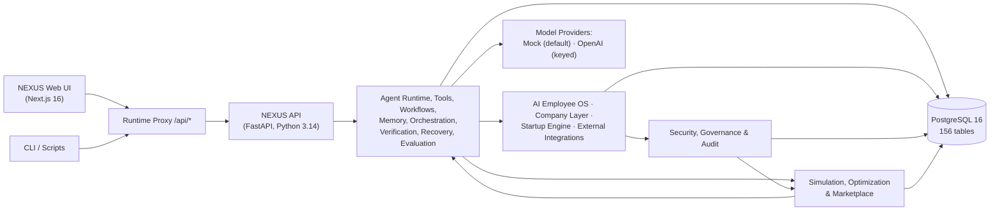

# NEXUS — Autonomous AI Workforce & Company OS

**An open-source platform where AI agents plan, coordinate, execute, verify, recover, simulate, and recommend — inside a governed company structure with approvals and full auditability.**

NEXUS is a full-stack AI platform, not a chatbot: a web console, a REST API, and a PostgreSQL database that together run an AI workforce end to end. It ships fully tested, runs with or without an API key, and is designed so a brand-new developer can have the system working in about five minutes.

---

## Quick Start (5 minutes)

**You only need Docker.** Postgres, Redis, the API, and the web UI all run in containers — no Python or Node installed on your machine.

```bash
git clone <repo-url> nexus-ai
cd nexus-ai
cp .env.example .env
docker compose up --build -d
```

On first boot the API container **auto-migrates the database** (empty → 156 tables) and seeds demo data, so your first `up` is your first working system. Wait ~30–60 seconds, then confirm everything is healthy:

```bash
docker compose ps        # all four services should say "(healthy)"
```

Open it:

| What | URL |
|------|-----|
| **Web UI** | <http://localhost:3000> |
| **API docs (Swagger)** | <http://localhost:8000/docs> |
| **Health probe** | <http://localhost:8000/api/v1/health/ready> |

To reset the demo data at any point:

```bash
bash scripts/run_demos.sh
```

> **Prefer running on the host?** Python 3.14+ and Node are required. See [Local development](#local-development).

### What you can do right away

- **Dashboard** — live counts, KPIs, and activity from seeded demo data.
- **Companies** — org chart, health score, KPIs, budgets, decisions, risks, alerts. Open **NEXUS Labs** (the seeded company) from the Companies page.
- **Agents → Tasks** — create an agent (`provider: mock`), create a task, assign, execute, and watch it flow through the runtime and land in **Activity**.
- **Approvals** — pending gates from the seeded governance demos; approve one and watch its audit log.
- **Marketplace** — a seeded agent-package catalog with benchmark scores and evidence-based recommendations.

A guided tour with annotated screenshots lives in **[docs/ui-tour.md](docs/ui-tour.md)**.

---

## Architecture

One system, one database. The web UI calls the API through a Next.js runtime proxy; the API composes the agent runtime, tooling, workflows, memory, orchestration, reliability, employee and company layers, security/governance, and a simulation–optimization–marketplace intelligence layer. Every tenant-scoped table carries a `company_id` foreign key — multi-tenant by construction.



Layer-by-layer engineering detail is in **[docs/architecture.md](docs/architecture.md)**, and a complete hands-on phase-by-phase walkthrough (with runnable examples) is in **[docs/phase-walkthroughs.md](docs/phase-walkthroughs.md)**.

---

## What NEXUS does

| Area | What it does |
|------|--------------|
| Agent Runtime | Validate → build context → tool loop → parse → persist. Typed executions with token/cost/latency metrics. |
| Tools & Actions | Permission-gated tool registry and executor with per-call timeout, output caps, and sandbox enforcement. |
| Workflows | Dependency-ordered pipelines with conditions, retries, triggers, and a database-backed worker + scheduler. |
| Memory | Five memory types with hybrid retrieval (semantic + keyword + recency) and namespace isolation. |
| Multi-agent orchestration | One objective → a coordinated team of agents with attribution for every finding. |
| Reliability | Shared verification (6 strategies), bounded self-healing recovery, and escalation to humans. |
| AI Employee OS | AI employees with skills, goals, workload, assignments, performance tracking, and audit. |
| AI Company OS | Companies, departments, org charts, KPI computation, budgets, policies, decisions, risks, alerts, health. |
| Startup Engine | Missions → strategy → plan → governed operating cycles, with bounded autonomy + approval gates. |
| External integrations | Governed funnels for email, web research, dev, and simulated browser/computer use. |
| Security & governance | Auth, RBAC/ABAC, encrypted secrets, hash-chained audit, kill switch, resource limits, observability. |
| Simulation, optimization & marketplace | Closed-sandbox simulation, approval-gated optimization and experiments, benchmarks, and an internal agent marketplace. |

---

## Technology stack

- **Backend** — FastAPI, SQLAlchemy, Alembic, Python 3.14, PostgreSQL 16.
- **Frontend** — Next.js 16 (App Router), React 19, TypeScript, Tailwind CSS.
- **Infrastructure** — Docker Compose (postgres / redis / api / web) with healthchecks and auto-migration on boot.
- **AI** — provider-agnostic `ModelProvider` seam. Ships a deterministic `MockProvider` (default, no key needed) and a real OpenAI adapter that activates when `OPENAI_API_KEY` is set.

## API keys

**None required.** Everything runs on the deterministic `MockProvider` out of the box. To use real models, set `OPENAI_API_KEY` in `.env` and restart the API — sessions without a key keep running unchanged. Usage is billed to your key.

---

## Testing

```bash
# Backend (from apps/api) — 1192 tests
.venv/bin/pytest -q
.venv/bin/ruff check app tests scripts
.venv/bin/ruff format --check app tests scripts

# Frontend (from apps/web) — 141 tests
npx tsc --noEmit && npm run lint && npm run build && npx vitest run

# Full production-mode verification (Docker Postgres + Redis, auth chain,
# worker drain, pgvector, load baseline, readiness report — exit 0)
bash scripts/run_production.sh
```

CI (`.github/workflows/ci.yml`) runs all of the above plus a migration round-trip, a key-gated model smoke, and the production harness on every push.

---

## Project structure

```
nexus-ai/
├── apps/
│   ├── api/            # FastAPI backend (app/, alembic/, scripts/, tests/)
│   └── web/            # Next.js frontend (src/app, components, lib)
├── docs/               # Architecture, operations, security, UI tour, phase walkthroughs
├── infrastructure/     # Dockerfiles + entrypoint
├── scripts/            # run_demos.sh, run_production.sh, backup/restore, deploy
├── docker-compose.yml
└── .env.example        # documented environment variables
```

## Local development

Backend and frontend on the host (Docker only for Postgres/Redis):

```bash
./scripts/setup.sh                    # one-shot bootstrap (venv + deps) — requires Python 3.14+
docker compose up -d postgres redis
cd apps/api && source .venv/bin/activate
alembic upgrade head
uvicorn app.main:app --reload
cd apps/web && npm install && npm run dev
```

---

## Documentation

- **Get started** — [UI tour](docs/ui-tour.md) · [Phase walkthroughs](docs/phase-walkthroughs.md) · [Demo guide](docs/demo.md)
- **Run & operate** — [Operations](docs/operations.md) · [Deploy](docs/operations.md#11-deployment) · [Disaster recovery](docs/disaster-recovery.md)
- **Design** — [Architecture](docs/architecture.md) · [Security](docs/security.md) · [Threat model](docs/threat-model.md)

---

## Honest status

- **Real and fully wired.** Web UI → proxy → FastAPI → PostgreSQL: storage, retrieval, executions, approvals, audit, KPIs — all real database-backed operations, verified by **1192 backend tests + 141 frontend tests** and a production-readiness harness that exits 0.
- **Intelligence is deterministic by default, real when you opt in.** Without a key, all agent output comes from the deterministic `MockProvider`. Set `OPENAI_API_KEY` and agents using `provider: "openai"` make real model calls.
- **It is a development platform, not a live production deployment.** By default auth is off and there is no TLS; the production-readiness check flags those until configured. `scripts/run_production.sh` flips on the full security chain and verifies it end-to-end.
