# NEXUS — Autonomous AI Workforce & Company OS

**A production-framed, fully-tested, open-source platform where AI agents plan, coordinate, execute, verify, heal, simulate, and recommend — inside a governed company structure with approvals and full auditability. Not a chatbot.**

> **Honest status:** development/demo platform, **not** a live production deployment. Everything runs end-to-end with real data flow, storage, and governance on your machine — and the intelligence layer ships a **real, keyed OpenAI adapter** (`OpenAIProvider`) that activates when `OPENAI_API_KEY` is set. By default (no key) it runs on the deterministic **MockProvider**, so nothing breaks on a stranger's machine. No API keys required anywhere (see [Is This Real or a Demo?](#is-this-real-or-a-demo) and [Production mode](#production-mode)).

---

## Quick Start (5 minutes)

**Prerequisite: Docker** (Postgres, Redis, API, Web all run in containers). That's it — no Python or Node needed on the host.

```bash
git clone <repo-url> nexus-ai
cd nexus-ai
cp .env.example .env          # defaults are fine for local use
docker compose up --build -d
```

On first boot the API container **auto-migrates the database** (empty → 156 tables at head `0014`), so your first `up` is also your first working system. Wait ~30–60s for all 4 containers to go healthy:

```bash
docker compose ps              # everything should say "(healthy)"
```

Then open:

| What | URL |
|------|-----|
| **Web UI** | <http://localhost:3000> |
| API docs (Swagger) | <http://localhost:8000/docs> |
| Health probes | <http://localhost:8000/api/v1/health/{live,ready,dependencies}> |

### After setup — do these 5 things to see the system working live

1. **Open the Dashboard** at <http://localhost:3000/> → you'll see a live status panel, KPI tiles, and activity from the seeded demo data (companies, agents, tasks, KPIs already populated).
2. **Open Companies** at <http://localhost:3000/companies> → **NEXUS Labs** is the flagship seeded company (it's the first row and the default scope). Open its detail page for the org chart, health score, KPIs, budgets, decisions, risks, and alerts — all computed from real seeded execution data.
3. **Run a task yourself** — Agents → create an agent (provider `mock`, status `active`) → Tasks → create a task → assign → execute → watch it land in **Activity**. Executes through the real pipeline (validate → context → tool loop → parse → persist) and stores an execution record.
4. **Check Approvals** at <http://localhost:3000/approvals> → pending approval gates from the seeded governance/simulation demos. Approve one and watch its audit log update.
5. **Open Marketplace** at <http://localhost:3000/marketplace> → the seeded published agent package, its benchmark scores, and evidence-based recommendations — the Phase 12 closed loop, tenant-scoped to your NEXUS Labs company.

Want **real data in every page** instead of just the default seed? The deterministic demo seeds all 5 phases of demo data:

```bash
bash scripts/run_demos.sh      # migrate → 5 seeds (--reset) → Phase 11+12 smoke (0×5xx) → summary
```

A guided route-by-route tour with annotated screenshots lives in **[docs/ui-tour.md](docs/ui-tour.md)**.

> **Prefer host-based dev over Docker?** Requires Python ≥ 3.14 + Node. See [Local development](#local-development).

---

## Architecture

One system, 14 layers, one database. The web UI talks to the API through a Next.js runtime proxy; the API composes 90+ model files (156 tables) across agent runtime, tools, workflows, memory, orchestration, reliability, employee OS, company layer, autonomous startup, external integrations, security/governance, and a simulation/optimization/marketplace intelligence layer. Every tenant-scoped table carries a `company_id` FK + index.

```mermaid
flowchart TD
    subgraph Client["🖥️ Client"]
        Web["NEXUS Web (Next.js 16, React 19, Tailwind v4)"]
        CLI["CLI / Scripts"]
    end

    subgraph Gateway["🌐 Gateway & Proxy"]
        WebProxy["Runtime Proxy /api/* → API"]
    end

    subgraph API["🔧 NEXUS API (FastAPI, Python 3.14)"]
        Auth["Auth Middleware (HS256, RBAC/ABAC, PolicyEngine)"]
        Health["Health Probes: /live /ready /dependencies"]
        API_V1["/api/v1/* Routers"]
    end

    subgraph Core_Services["⚙️ Core Services"]
        Runtime["Agent Runtime (validate→context→tool loop→parse→persist)"]
        Tools["Tool Registry + ToolExecutor (perm-gated)"]
        Workflow["Workflow Engine (topo-sort) + Worker + Scheduler"]
        Memory["Memory Service (5 types, hybrid retrieval, namespace)"]
        Orchestration["Orchestrator (Planner→Selector→Bus→Synthesizer)"]
        Verification["Verification Service (6 strategies)"]
        Recovery["Recovery Engine (10 strategies, budgets)"]
        Evaluation["Evaluation (metrics, datasets, regression)"]
    end

    subgraph Employee_Company["👥 Employee OS + Company Layer (Ph 7–8)"]
        EmployeeOS["EmployeeManager (lifecycle, skills, goals, workload, assignment, performance, templates, audit)"]
        CompanyOS["CompanyManager (companies, depts, memberships, roles, goals, KPIs, budgets, policies, decisions, risks, alerts, health, reports, events)"]
    end

    subgraph Startup["🚀 Autonomous Startup Engine (Ph 9)"]
        Mission["MissionService (analyze, validate, plan)"]
        Bootstrap["StartupPlanner + Bootstrap (Company + Workforce)"]
        Cycles["OperatingEngine (observe→assess→plan→prioritize→allocate→execute→verify→measure→learn→replan)"]
        Autonomy["AutonomyService (allow/require_approval/block) + ApprovalGateManager"]
    end

    subgraph External["🔌 External Integrations (Ph 10)"]
        ExtMgr["ExternalActionManager (risk→policy→approval→exec→verify→recover→audit)"]
        Integrations["IntegrationProvider Registry (Email, Calendar, Dev, WebResearch, GenericHTTP OFF)"]
        Browser["Browser Sessions (simulated, bounded, UNTRUSTED)"]
        Computer["Computer Sessions (simulated, bounded, UNTRUSTED)"]
        Credentials["Reference-only Credentials (env-sourced, never in DB)"]
        SSRF["SecureHTTPClient (SSRF, redirect revalidation, caps)"]
    end

    subgraph Security["🛡️ Security, Governance & Observability (Ph 11)"]
        Identity["Identity (unified principal table)"]
        AuthZ["AuthorizationService (IDENTITY→AUTHZ→POLICY→LIMIT→APPROVAL→ACTION→VERIFY→AUDIT→OBS→RECOVER)"]
        Secrets["SecretManager (Fernet AES-256-GCM, key rotation, mask hints)"]
        Audit["AuditService (append-only hash-chain + /verify)"]
        Detection["13-category Detection → Alert → Incident → Containment"]
        Governance["GovernanceGuard (kill switch, resource limits, break-glass, feature flags)"]
        Telemetry["Telemetry (request/trace IDs) + Metrics + Redaction"]
    end

    subgraph Sim_Opt["🧠 Simulation, Optimization & Marketplace (Ph 12)"]
        Sim["SimulationEngine (Sandbox, Monte-Carlo, DigitalTwin, checkpoints) — SIMULATED/FORECAST only"]
        Opt["OptimizationEngine (greedy/exhaustive/ranking, policy/budget filter, 10-part explainability, ApprovalGate)"]
        Exp["ExperimentEngine (approval-gated, WINNER/LOSER/INCONCLUSIVE)"]
        Bench["BenchmarkEngine (8 dimensions, reuses Ph6 metrics)"]
        Market["Marketplace (metadata-only, PackageScanner, evidence recs, approval-gated install)"]
        Loop["NEXUSOptimizationLoop (OBSERVE→SIMULATE→OPTIMIZE→PROPOSE→APPROVE→EXECUTE→MEASURE→LEARN)"]
    end

    subgraph Data["💾 Data Layer"]
        PG["PostgreSQL 16 (156 tables, company_id FK + index on every tenant table)"]
        Redis["Redis 7 (optional, future cache/queues)"]
        Alembic["Alembic (head: 0014_phase12_sim_opt_mkt)"]
    end

    subgraph AI["🤖 AI Providers"]
        Mock["MockProvider (deterministic — default, CI/tests, no keys)"]
        Real["OpenAIProvider (real when OPENAI_API_KEY set; keyless fallback otherwise)"]
    end

    %% Client → Gateway
    Web --> WebProxy
    CLI --> WebProxy

    %% Gateway → API
    WebProxy --> Auth
    Auth --> Health
    Auth --> API_V1

    %% API → Core
    API_V1 --> Runtime
    API_V1 --> Tools
    API_V1 --> Workflow
    API_V1 --> Memory
    API_V1 --> Orchestration
    API_V1 --> Verification
    API_V1 --> Recovery
    API_V1 --> Evaluation

    %% Core → Employee/Company
    Runtime --> EmployeeOS
    Workflow --> EmployeeOS
    Orchestration --> EmployeeOS
    EmployeeOS --> CompanyOS
    CompanyOS --> EmployeeOS

    %% Company → Startup
    CompanyOS --> Mission
    Mission --> Bootstrap
    Bootstrap --> Cycles
    Cycles --> Autonomy
    Autonomy --> EmployeeOS
    Autonomy --> CompanyOS

    %% Core + Company → External
    Tools --> ExtMgr
    Workflow --> ExtMgr
    Orchestration --> ExtMgr
    ExtMgr --> Integrations
    ExtMgr --> Browser
    ExtMgr --> Computer
    ExtMgr --> Credentials
    Integrations --> SSRF
    Browser --> SSRF
    Computer --> SSRF

    %% Security wraps everything
    Auth --> Identity
    AuthZ --> Identity
    AuthZ --> Secrets
    AuthZ --> Audit
    AuthZ --> Detection
    AuthZ --> Governance
    AuthZ --> Telemetry

    %% Phase 12 composes Ph 11 + 9 + 8 + 6 + 7
    Sim --> Governance
    Opt --> Autonomy
    Opt --> Governance
    Exp --> Governance
    Bench --> Evaluation
    Market --> EmployeeOS
    Loop --> Sim
    Loop --> Opt
    Loop --> Exp
    Loop --> Bench
    Loop --> Market

    %% Data
    Runtime --> PG
    Tools --> PG
    Workflow --> PG
    Memory --> PG
    Orchestration --> PG
    Verification --> PG
    Recovery --> PG
    Evaluation --> PG
    EmployeeOS --> PG
    CompanyOS --> PG
    Mission --> PG
    Bootstrap --> PG
    Cycles --> PG
    Autonomy --> PG
    ExtMgr --> PG
    Integrations --> PG
    Browser --> PG
    Computer --> PG
    Credentials --> PG
    Identity --> PG
    AuthZ --> PG
    Secrets --> PG
    Audit --> PG
    Detection --> PG
    Governance --> PG
    Telemetry --> PG
    Sim --> PG
    Opt --> PG
    Exp --> PG
    Bench --> PG
    Market --> PG
    Loop --> PG

    %% AI Providers
    Runtime --> Mock
    Runtime --> Real

    %% Redis
    Workflow -.-> Redis
    Memory -.-> Redis
    Telemetry -.-> Redis

    classDef client fill:#e3f2fd,stroke:#1565c0,stroke-width:2px;
    classDef gateway fill:#fff3e0,stroke:#ef6c00,stroke-width:2px;
    classDef api fill:#f3e5f5,stroke:#7b1fa2,stroke-width:2px;
    classDef core fill:#e8f5e9,stroke:#2e7d32,stroke-width:2px;
    classDef emp fill:#fce4ec,stroke:#c2185b,stroke-width:2px;
    classDef startup fill:#fff8e1,stroke:#f57f17,stroke-width:2px;
    classDef ext fill:#f1f8e9,stroke:#558b2f,stroke-width:2px;
    classDef sec fill:#fafafa,stroke:#424242,stroke-width:2px;
    classDef sim fill:#e0f2f1,stroke:#00695c,stroke-width:2px;
    classDef data fill:#eceff1,stroke:#37474f,stroke-width:2px;
    classDef ai fill:#fbe9e7,stroke:#bf360c,stroke-width:2px;

    class Web,CLI client;
    class WebProxy gateway;
    class Auth,Health,API_V1 api;
    class Runtime,Tools,Workflow,Memory,Orchestration,Verification,Recovery,Evaluation core;
    class EmployeeOS,CompanyOS emp;
    class Mission,Bootstrap,Cycles,Autonomy startup;
    class ExtMgr,Integrations,Browser,Computer,Credentials,SSRF ext;
    class Identity,AuthZ,Secrets,Audit,Detection,Governance,Telemetry sec;
    class Sim,Opt,Exp,Bench,Market,Loop sim;
    class PG,Redis,Alembic data;
    class Mock,Real ai;
```



The layer-by-layer engineering reference and the responsibility-boundary diagram are in **[docs/architecture.md](docs/architecture.md)**.

---

## Is This Real or a Demo?

Straight answer, no spin:

- ✅ **The pipeline is real and fully wired.** Data flows end-to-end: Web UI → Next.js proxy → FastAPI → PostgreSQL. Storage, retrieval, execution records, approvals, audit chains, KPIs, benchmarks — all real database-backed operations, all verified by 1144 backend tests + 141 frontend tests.
- ✅ **It runs on a stranger's machine.** Verified by cold-starting from empty volumes: `docker compose up` on a clean checkout auto-migrates 156 tables and seeds live demo data, with every UI page responding HTTP 200.
- ⚠️ **The intelligence is deterministic by default, real when you opt in.** All agent/tool/workflow "thinking" runs on the `MockProvider` (deterministic, needs no API key) unless `OPENAI_API_KEY` is set — then the **real `OpenAIProvider`** makes actual Chat Completions calls (bounded timeout, exponential-backoff retries, token metrics), and `OpenAIEmbeddingProvider` calls real embeddings, with graceful keyless fallback so a stranger's machine never breaks. Set `memory_embedding_provider=openai` in `.env` to enable semantic embeddings.
- ⚠️ **It is a development/demo platform, not a live production deployment.** Auth is off by default (`AUTH_ENABLED=false`), there's no TLS, single host, and no compliance certifications or SLAs are claimed. The `production_readiness` check intentionally FAILs until those are configured.

**API keys?** None required — every demo, test, and page runs on the MockProvider, and the OpenAI adapters silently fall back to deterministic output when no key is set. Add `OPENAI_API_KEY` to your local `.env` and agents using `provider="openai"` make **real** model calls (usage is metered to your key at your cost); sessions without a key keep running unchanged.

**What happens on real data?** The same paths handle real users/companies/agents/tasks — the seed data and live CRUD go through identical APIs and tables. The only simulation-specific behavior is deliberately labeled SIMULATED / FORECAST / RECOMMENDATION and never mutates production rows.

---

## User Interface

A full web console covering every phase — Dashboard, Companies (executive view), Agents, Tasks, Activity, Workflows, Memories, Employees (directory/workbench/goals/performance), Startup Engine, External integrations (browser/computer), Approvals, plus Phase 12 Simulation/Optimization/Experiments/Benchmarks/Marketplace and Phase 11 Control Center (security, audit, incidents, governance, health, access).

| | |
|---|---|
| **Dashboard** — live agent/task/approval counts, KPIs, activity feed | **Companies** — org chart, health score, KPIs, budgets, decisions, risks |
|  |  |
| **Approvals** — pending gates one screen away | **Marketplace** — package catalog, benchmark scores, recommendations |
|  |  |
| **Startup Engine** — mission graph, cycles, products, gates | **Control Center** — security, audit, incidents, health |
|  |  |

Screen size matters here — **[docs/ui-tour.md](docs/ui-tour.md)** walks every region of the app with annotated screenshots and the exact seed data you should see in each view.

---

## Core Capabilities

| Area | What it does | Phase |
|------|--------------|-------|
| Agent Runtime | `validate → context → tool loop → parse → persist`; typed `AgentExecution` | 1 |
| Tool & Action System | Permission-gated registry (`ToolExecutor`), 4 built-ins | 2 |
| Workflow Orchestration | Dependency-ordered steps, retry/timeout/conditions, DB-as-queue worker + scheduler | 3 |
| Memory | 5 types, hybrid retrieval (semantic+keyword+recency), namespace isolation, auto-extraction | 4 |
| Multi-Agent Orchestration | Planner → Selector → Orchestrator → Bus → Synthesizer (conflicts + attribution) | 5 |
| Verification / Recovery / Evaluation | Shared verifier (6 strategies), bounded self-healing (10 strategies), regressions | 6 |
| AI Employee OS | Identity, skills, goals, workload, assignment, performance, templates, audit | 7 |
| AI Company Layer | Companies, departments, KPIs (computed), budgets (hierarchical), policies (MRW), decisions, risks, alerts, health | 8 |
| Autonomous Startup Engine | Mission → plan → bootstrap → operating cycles → feedback → replan; approval gates; bounded autonomy | 9 |
| External Integrations & Computer Use | Gov't funnel, reference-only credentials, simulated browser/computer, SSRF/prompt-injection | 10 |
| Security, Governance & Production Hardening | HS256 auth, RBAC/ABAC, Fernet secrets, hash-chained audit, kill switch, resource limits, telemetry | 11 |
| Simulation, Optimization & Marketplace | Closed-sandbox simulation, multi-objective optimization (proposes → gate decides), experiments, benchmarks, internal marketplace, closed loop | 12 |

---

## Technology Stack *(implemented only)*

- **Backend**: FastAPI + SQLAlchemy + Alembic (head `0014_phase12_sim_opt_mkt`), Python 3.14, psycopg (PostgreSQL 16), pydantic-settings. Runtime deps pinned to the CI-validated set.
- **Frontend**: Next.js 16 (App Router), React 19, Tailwind v4, TypeScript (strict), vitest.
- **Infrastructure**: Docker Compose (postgres/redis/api/web, healthchecks), auto-migration entrypoint (`AUTO_MIGRATE`), CI with migration round-trip + readiness gate.
- **AI**: provider-agnostic `ModelProvider` seam ([`app/ai/providers/`](apps/api/app/ai/providers/)) — **two** shipped providers: `MockProvider` (deterministic, API-key-free, the default) and a **real `OpenAIProvider`** (Chat Completions over httpx with retry/backoff, keyless fallback, token-cost metrics). An `OpenAIEmbeddingProvider` (same transport) powers semantic memory when configured. Providers activate by setting `OPENAI_API_KEY` (see [Is This Real or a Demo?](#is-this-real-or-a-demo)).

---

## API Keys

**No API keys are required, and none are exercised.** The whole platform runs on `MockProvider`, which is deterministic, offline, and free. If you later implement a real adapter (`app/ai/providers/`), keys would be supplied as environment variables and routed via the provider registry — nothing else in the platform changes.

---

## Troubleshooting

| Symptom | Cause | Fix |
|---------|-------|-----|
| `docker compose up --build` fails on `Address already in use` | Host port 3000/8000/5433 already taken | `POSTGRES_PORT=<other>` in `.env`, or stop the other service; the 📖 [operations.md](docs/operations.md) shows the full port map |
| Containers not healthy / Web shows API errors | First boot migration still running, or API not ready yet | `docker compose ps` and wait for all `(healthy)`; `docker compose logs api` to see the `alembic upgrade head` run |
| Database not migrated | `AUTO_MIGRATE=false` set, or used host dev without running migrations | Unset `AUTO_MIGRATE` (or run `.venv/bin/alembic upgrade head` from `apps/api`) |
| Seeded demo missing pages/data | Seeds not run (Docker path runs them automatically) | `bash scripts/run_demos.sh` from the repo root |
| Local dev: `pip install` resolves different versions than CI | Host Python < 3.14, or pip skipped pins | Use Docker, or install Python ≥ 3.14 (enforced by `scripts/setup.sh`) |
| `scripts/setup.sh` refuses to run | Python 3.12/3.13 on host | Install Python 3.14+ or use the Docker path |
| Seed crash `top.rank == 1` | Stale orphaned marketplace rows in an old DB | `bash scripts/run_demos.sh` (it resets + prunes orphans) |
| Web reachable but API calls 500 | API container not healthy / DB down | `curl -sf localhost:8000/api/v1/health/ready`; check `docker compose ps` |
| Want auth enforced on this stack | Production-only by design | Set `AUTH_ENABLED=true` + keys (see [docs/security.md](docs/security.md)) |

---

## Security

NEXUS composes Phase 11 security, governance & observability: HS256 auth +
RBAC/ABAC + policy engine (most-restrictive-wins), Fernet AES-256-GCM secrets
from env only, append-only hash-chained audit with `verify_chain()`, SSRF +
prompt-injection + filesystem + tool-escalation hardening, kill switch scopes,
resource limits, redaction, telemetry/metrics. Health probes at
`/api/v1/health/{live,ready,dependencies}` never leak secret values.

**Boundaries (never claimed):** no compliance certifications, no production
SLAs (perf numbers are dev-environment measurements), no managed vault, no
real-LLM **deployment** (real LLM calls are opt-in via your own `OPENAI_API_KEY`,
metered to your account). Optimizations **propose** — governance
**decides**. Simulation outputs are forecasts, never commitments.

### Production mode

Auth, rate limiting, observability, security headers, and request-body limits
all ship in this repo and are wired end-to-end, but they are **gated off by
default** so the demo and the full test suite stay open. `scripts/run_production.sh`
flips the production chain on and verifies it over HTTP in one command:

```bash
bash scripts/run_production.sh
```

What it does: starts Postgres + Redis, applies migrations, seeds core company
data, boots the API with `AUTH_ENABLED=true RATE_LIMIT_ENABLED=true
METRICS_ENABLED=true` (plus fresh ephemeral JWT/encryption secrets), then
proves the enforced chain end-to-end — unauthenticated request → `401
auth_required`, bootstrap-admin login → bearer token, authed read → `200`,
wrong password → `403 invalid_credentials`, a concurrent load baseline, and a
production-readiness report. A sample production env is documented in
[`apps/api/.env.production.example`](apps/api/.env.production.example) and the
full picture lives in [docs/operations.md](docs/operations.md) (§Production
mode & load baseline) + [docs/security.md](docs/security.md).

**What stays demo-only even in production mode:** a single host, in-process
worker threads (not a distributed queue), in-memory rate-limit buckets, and no
compliance certifications or SLAs. Perf bounds are indicative dev-machine
measurements, not contracts. See the production-readiness check for the
deliberately-failing items (`python -m app.checks.production_readiness`).

- [docs/security.md](docs/security.md) · [docs/threat-model.md](docs/threat-model.md)
- [docs/operations.md](docs/operations.md) · [docs/incident-response.md](docs/incident-response.md)
- [docs/disaster-recovery.md](docs/disaster-recovery.md) · [docs/data-governance.md](docs/data-governance.md)

---

## Testing

```bash
# Backend (from apps/api)
.venv/bin/pytest -q                                # 1144 tests across 107 files
.venv/bin/ruff check app tests scripts
.venv/bin/ruff format --check app tests scripts

# Frontend (from apps/web)
npx tsc --noEmit && npm run lint && npm run build && npx vitest run   # 141 tests

# Perf baseline (dev-environment measurements, not SLAs)
cd apps/api && .venv/bin/python -m scripts.perf_baseline
```

CI (`.github/workflows/ci.yml`) runs backend (ruff, pytest), **migration
round-trip** (`upgrade head` → `downgrade base` → `upgrade head` on a Postgres
service container), non-blocking `production_readiness`, and frontend
(lint/tsc/vitest/build) plus Docker build.

---

## Project Structure

```
nexus-ai/
├── apps/
│   ├── api/        # FastAPI backend
│   │   ├── app/
│   │   │   ├── core/        # config, logging, errors, telemetry, metrics, redaction
│   │   │   ├── api/v1/      # versioned HTTP endpoints + health probes
│   │   │   ├── ai/          # ModelProvider seam (mock = default; openai = real when keyed)
│   │   │   ├── db/models/   # SQLAlchemy models (156 tables, phases 0–12)
│   │   │   ├── schemas/     # Pydantic contracts
│   │   │   ├── services/    # persistence + runtime assembly
│   │   │   ├── runtime/  tools/  workflow/  memory/
│   │   │   ├── orchestration/  verification/  recovery/  evaluation/
│   │   │   ├── employee/   company/   startup/   external/   security/
│   │   │   ├── phase12/    # simulation, optimization, experiments, benchmarks, marketplace, closed loop
│   │   │   └── checks/     # production_readiness
│   │   ├── alembic/        # migrations (0014 = Phase 12 head)
│   │   ├── scripts/        # 5 seeds, smoke_api, perf_baseline
│   │   └── tests/          # 1144 tests (SQLite, MockProvider)
│   └── web/        # Next.js frontend (approvals, settings, phase-12 centers, shells)
│       ├── src/app/
│       ├── src/components/
│       └── src/lib/        # API client, types, navigation
├── docs/           # portfolio set: architecture, security, operations, portfolio,
│   │               # case-study, demo, final-readiness, roadmap, ui-tour + images
│   └── images/     # real UI screenshots
├── infrastructure/docker/  # Dockerfiles + docker-entrypoint.sh
├── scripts/        # run_demos.sh, setup.sh
├── docker-compose.yml
└── .env.example    # documented environment variables
```

---

### Local development

Backend/frontend on the host (Docker only for Postgres/Redis):

```bash
./scripts/setup.sh            # one-shot bootstrap (venv, deps, infra) — enforces Python >= 3.14
docker compose up -d postgres redis
cd apps/api && source .venv/bin/activate && alembic upgrade head && uvicorn app.main:app --reload
cd apps/web && npm install && npm run dev
```

---

## Documentation

- **Run & demo**: [UI tour (screenshots)](docs/ui-tour.md) · [demo guide (14-item checklist)](docs/demo.md) · [operations](docs/operations.md)
- **Portfolio**: [portfolio](docs/portfolio.md) · [case-study](docs/case-study.md) · [final-readiness](docs/final-readiness.md)
- **Design**: [architecture (master diagram)](docs/architecture.md) · [roadmap](docs/roadmap.md)
- **Phase references**: [workflows](docs/workflows.md) · [memory](docs/memory.md) · [orchestration](docs/orchestration.md) · [reliability](docs/reliability.md) · [employee-os](docs/employee-os.md) · [company-os](docs/company-os.md) · [phase-9-autonomous-startup](docs/phase-9-autonomous-startup.md) · [phase-10-external-integrations](docs/phase-10-external-integrations.md) · [security-architecture](docs/security-architecture.md) · [phase-11-production-hardening](docs/phase-11-production-hardening.md) · [phase-12](docs/phase-12.md) + topic docs ([simulation](docs/simulation.md) · [optimization](docs/optimization.md) · [experimentation](docs/experimentation.md) · [benchmarking](docs/benchmarking.md) · [agent-marketplace](docs/agent-marketplace.md) · [closed-loop-optimization](docs/closed-loop-optimization.md))

---

## Phase Walkthroughs *(appendix)*

The per-phase walkthroughs — the original "Try it in 60 seconds" guides — are
preserved verbatim below. They are the hands-on reference for how each layer
works; the seeded demos in [docs/demo.md](docs/demo.md) are the faster way to
see everything working at once.

---

### Phase 1 — Agent Runtime

The core loop is **User → API → Agent → Task → Agent Runtime → Model Provider → Agent Result → Execution Record**.

```
┌────┐   ┌──────────┐   ┌───────┐   ┌─────────┐   ┌───────────────┐
│ UI │──▶│ API      │──▶│ Agent │──▶│ Task    │──▶│ Agent Runtime │──▶ Model Provider
└────┘   │ /agents  │   │       │   │ /tasks  │   │  (validate →  │
         │ /tasks   │   └───────┘   └─────────┘   │   build ctx →  │
         │ /execute │                              │   execute →    │──▶ AgentResult
         └──────────┘                              │   parse →      │        │
                                                   │   persist)     │        ▼
                                                   └───────────────┘   Execution Record
                                                                       (DB)
```

- **Agents** carry a role, system prompt, and model configuration (provider, model, temperature, max_tokens). Only `active` agents can execute tasks.
- **Tasks** are discrete units of work with an optional JSON input payload, assigned to a single agent.
- **Executing a task** runs the runtime pipeline, calls the configured provider, parses the structured `AgentResult`, and persists it as an `AgentExecution` with token usage, cost estimate, and latency.
- **Mock provider** (`provider = "mock"`) returns deterministic output with no API key, so the whole flow is exercisable locally and in CI.

#### Try it in 60 seconds

```bash
# 1. Start the stack (or your existing local dev servers)
docker compose up -d

# 2. Create an active mock agent
curl -X POST localhost:8000/api/v1/agents -H 'Content-Type: application/json' \
  -d '{"name":"analyst","role":"analyst","status":"active","provider":"mock","model_name":"mock-model"}'

# 3. Create + assign + execute a task
TASK=$(curl -X POST localhost:8000/api/v1/tasks -H 'Content-Type: application/json' \
  -d '{"title":"Summarize Q1","input_data":{"quarter":"Q1"}}' | jq -r .id)
curl -X POST localhost:8000/api/v1/tasks/$TASK/assign -H 'Content-Type: application/json' \
  -d '{"agent_id":"<agent_id>"}'
curl -X POST localhost:8000/api/v1/tasks/$TASK/execute

# 4. Watch the activity feed
curl localhost:8000/api/v1/executions
```

The equivalent, nicer flow lives in the UI: **Agents** (create/activate/delete), **Tasks** (create/assign/execute/view executions), and **Activity** (global execution feed). Agent and task counts are surfaced on the dashboard.

---

### Phase 2 — Tool & Action System

The runtime now runs a **tool-calling loop**: after the model generates, if its JSON contains `{"tool_calls": [...]}` the runtime executes each tool through the permission-gated `ToolExecutor`, feeds the results back, and loops — until the model returns a final `AgentResult` or `max_tool_iterations` is reached.

**Registered tools** (`GET /api/v1/tools`): `calculator`, `datetime`, `text_utils`, `json_utils`.

**Permission model:** non-dangerous tools are allowed by default; `dangerous` tools require an explicit allowlist; explicit deny always wins; an admin flag bypasses all checks.

Every tool invocation is validated, authorized, timed-out (per-tool, thread-pool), and persisted as a `ToolCallRecord` in the `tool_calls` table — traceable to its execution, with arguments, result, and latency. Per-agent access is recorded in `agent_tool_permissions`.

**Driving a real tool call locally (mock):** the runtime reads optional `model_params` on a mock agent — `script` (an ordered list of JSON responses) or `reply` (a single response) — and builds a scripted `MockProvider` from them. Passing `{"script": ["{\"tool_calls\":[...]}", "{\"summary\":...}"]}` makes the mock request a tool on its first call and return a final `AgentResult` after, so the full loop (request → execute → feed back → answer) runs end-to-end over the HTTP API with no provider injection and no API key.

The **Tools** page in the UI lists every registered tool definition. The **Tasks** page embeds a per-execution tool-call inspector (`ToolCallsSection`) that fetches `GET /api/v1/tools/calls/{execution_id}` on demand.

#### Try it in 60 seconds

```bash
# 1. Create an active mock agent that requests the calculator tool, then answers
curl -X POST localhost:8000/api/v1/agents -H 'Content-Type: application/json' \
  -d '{"name":"analyst","role":"analyst","status":"active","provider":"mock","model_name":"mock-model",
       "model_params":{"script":["{\"tool_calls\":[{\"tool\":\"calculator\",\"arguments\":{\"expression\":\"6 * 7\"}}]}",
                                  "{\"summary\":\"computed\",\"output\":{\"result\":42}}"]}}'

# 2. Create + assign + execute a task (the mock drives the full tool-calling loop)
TASK=$(curl -X POST localhost:8000/api/v1/tasks -H 'Content-Type: application/json' \
  -d '{"title":"Calculate 6*7 using a tool","input_data":{}}' | jq -r .id)
curl -X POST localhost:8000/api/v1/tasks/$TASK/assign -H 'Content-Type: application/json' \
  -d '{"agent_id":"<agent_id>"}'
curl -X POST localhost:8000/api/v1/tasks/$TASK/execute

# 3. Inspect the persisted tool call for that execution
EXEC_ID=$(curl localhost:8000/api/v1/executions | jq -r '.[0].id')
curl localhost:8000/api/v1/tools/calls/$EXEC_ID
```

---

### Phase 3 — Workflow Orchestration

Workflows compose agents and tools into **durable, dependency-ordered pipelines** with structured data flow, condition branching, retry/timeout, and triggers. Execution state is a single JSON document (`input` + per-step `output`); each step's `input_mapping` pulls values from it by path, so later steps consume earlier steps' output.

**Step types**: `agent_task` (runs an agent via the runtime), `tool_action` (runs a tool via the permission-gated `ToolExecutor`), `condition` (safe branching with `eq/ne/gt/gte/lt/lte/contains/not_contains` + `and`/`or`), and `delay`. A false condition marks the step — and its dependents — `skipped` for deterministic gating. Steps carry optional `retry_policy` (gated by `idempotency`: side-effecting steps are never auto-retried) and `timeout_seconds`.

**Orchestration is durable with zero extra infrastructure**: `workflow_executions` rows act as a **DB-as-queue**; an in-process `WorkflowWorker` claims them atomically and an in-process `WorkflowScheduler` fires due `schedule`/`event`/`webhook` triggers. Both auto-start with the API when `WORKFLOW_WORKER_ENABLED=true` (off in tests) and recover stale runs on restart. Workflow statuses: `draft` → `active` → `paused`.

The **Workflows** page in the UI creates/edits workflows, manages steps and triggers, activates/pauses, and visualizes each execution as a step trace. A `/workflows/[id]` page shows the latest execution running through a step-by-step visualization.

#### Try it in 60 seconds

```bash
# 1. Create an active mock agent to power the research step
curl -X POST localhost:8000/api/v1/agents -H 'Content-Type: application/json' \
  -d '{"name":"researcher","role":"researcher","status":"active","provider":"mock","model_name":"mock-model"}'

# 2. Create a workflow
WF=$(curl -X POST localhost:8000/api/v1/workflows -H 'Content-Type: application/json' \
  -d '{"name":"Daily research digest","description":"Research, gate on volume."}' | jq -r .id)

# 3. Add research → condition → notify steps (dependency-ordered)
curl -X POST localhost:8000/api/v1/workflows/$WF/steps -H 'Content-Type: application/json' \
  -d "{\"name\":\"research\",\"step_type\":\"agent_task\",\"configuration\":{\"agent_id\":\"<agent_id>\",\"input_mapping\":{\"topic\":\"input.topic\"}}}"
curl -X POST localhost:8000/api/v1/workflows/$WF/steps -H 'Content-Type: application/json' \
  -d '{"name":"gate","step_type":"condition","dependencies":["research"],\
       "configuration":{"condition":{"field":"steps.research.output.lead_count","op":"gt","value":50}}}'
curl -X POST localhost:8000/api/v1/workflows/$WF/steps -H 'Content-Type: application/json' \
  -d '{"name":"notify","step_type":"tool_action","dependencies":["gate"],\
       "configuration":{"tool_name":"calculator","arguments":{"expression":"40 + 2"}}}'

# 4. Activate, execute with input, and inspect the step trace
curl -X POST localhost:8000/api/v1/workflows/$WF/activate
curl -X POST localhost:8000/api/v1/workflows/$WF/execute -H 'Content-Type: application/json' \
  -d '{"input_data":{"topic":"AI trends"}}'
EXEC_ID=$(curl localhost:8000/api/v1/workflows/$WF/executions | jq -r '.[0].id')
curl localhost:8000/api/v1/workflows/executions/$EXEC_ID/steps
```

If the mock returns `lead_count > 50`, `notify` runs; otherwise `gate` and `notify` are skipped — deterministic branching, visible in the step trace.

See [docs/workflows.md](docs/workflows.md) for the full workflow reference.

---

### Phase 4 — Memory System

NEXUS agents now have a **persistent memory**. When an agent completes a task, the runtime auto-extracts memories; on the next run, relevant ones are retrieved and injected into the agent's context — so agents recall prior work across sessions.

**Five memory types** (`working`, `episodic`, `semantic`, `procedural`, `structured`) live in a single `memories` table, isolated by **namespace** and scoped by **ownership** (agent or system). Working memory expires via TTL; every memory can be active, archived, or expired.

**Retrieval is hybrid** — `HybridRetriever` scores memories by weighted **semantic** (embedding cosine, when a provider is present) + **keyword** (Dice overlap) + **recency** (half-life decay) + **importance** + **confidence**, and exposes a per-result `breakdown` so you can see *why* something ranked. Embeddings are provider-independent: the bundled `MockEmbeddingProvider` is deterministic and free (works in CI), and `OpenAIEmbeddingProvider` (works when `OPENAI_API_KEY` is set) calls the real `/embeddings` API with a neutral-vector fallback when keyless. With no provider configured, retrieval still works via keyword matching.

**The runtime integrates memory into the loop**: it retrieves relevant memories *before* building the context (injecting a `[Memory]`-labeled section into the system prompt) and extracts+persists new memories *after* execution completes. Both hooks are best-effort and never block a run. Access is tracked (count + timestamp) on everything actually injected.

The **Memories** page in the UI lets you browse, hybrid-search, filter by type/status/agent, create memories manually, archive/delete, clean up expired ones, and page through large stores.

#### Try it in 60 seconds

```bash
# 1. Create an active mock agent, then create + assign + execute a task
curl -X POST localhost:8000/api/v1/agents -H 'Content-Type: application/json' \
  -d '{"name":"analyst","role":"analyst","status":"active","provider":"mock","model_name":"mock-model",
       "model_params":{"reply":"{\"summary\":\"Q1 done\",\"output\":{\"quarter\":\"Q1\",\"growth\":0.12}}"}'
TASK=$(curl -X POST localhost:8000/api/v1/tasks -H 'Content-Type: application/json' \
  -d '{"title":"Summarize Q1","input_data":{"quarter":"Q1"}}' | jq -r .id)
curl -X POST localhost:8000/api/v1/tasks/$TASK/assign -H 'Content-Type: application/json' \
  -d '{"agent_id":"<agent_id>"}'
curl -X POST localhost:8000/api/v1/tasks/$TASK/execute

# 2. See the auto-extracted memories for that agent (in the "default" namespace)
curl 'localhost:8000/api/v1/memories?namespace=default'

# 3. Hybrid-search them by topic
curl -X POST localhost:8000/api/v1/memories/search \
  -H 'Content-Type: application/json' \
  -d '{"query":"Q1 growth","namespace":"default","top_k":5}'
```

With `memory_extraction_enabled=true` (the default), executing a task automatically creates an **episodic** memory, plus **semantic** (on success+output) and **procedural** (when tools were used) memories — ready to be recalled on the next run.

See [docs/memory.md](docs/memory.md) for the full memory reference.

---

### Phase 5 — Multi-Agent Orchestration

NEXUS agents now work as **teams**. Instead of one agent per task, you state an objective and the system assembles a coordinated team to achieve it — decomposed, assigned, executed, and verified together.

**The engine is deterministic and provider-independent** (`app/orchestration/`): a `DeterministicPlanner` turns an objective into a validated task graph (e.g. a market analysis decomposes into Research → Analysis → Fact-check in parallel, then Writer). A `CapabilityAgentSelector` assigns each task to the best-available active agent by **capability coverage** — role-derived and tool-permission-derived — with round-robin load spreading. An `Orchestrator` runs ready tasks in a bounded thread pool over a DB-backed, authorization-enforced **`AgentMessageBus`**, then detects conflicts and synthesizes a final result with **full source attribution** — every finding and source traced to its agent and task.

- **Lifecycle state machine** — `created → planning → planned → assigning → running → synthesizing → completed`, with legal paths to `failed` / `partially_completed` / `cancelled`; illegal transitions raise rather than drift.
- **Parallel + sequential execution** — tasks with no dependencies run concurrently; dependents run when their prerequisites complete; a failed task marks only its dependents `skipped` (independent work continues).
- **Shared context & memory** — each task receives only the facts + prior outputs relevant to it; shared facts persist to context and Phase 4 memory.
- **Observable** — every run exposes tasks, assignments, messages, results, reviews, and a timeline in the API and the UI.
- **Workflows can call orchestrations** — an orchestration is a first-class workflow step type.
- **Demo** — create four mock agents, set an objective like *"analyze the competitive market and write a report"*, and watch the research team run end to end with no API key.

#### Try it in 60 seconds

```bash
# 1. Stand up four active mock agents with market-team roles
for spec in 'researcher|researcher' 'analyst|analyst' 'fact_checker|fact_checker' 'writer|writer'; do
  role=${spec#*|}; name=${spec%|*}
  curl -X POST localhost:8000/api/v1/agents -H 'Content-Type: application/json' \
    -d "{\"name\":\"$name\",\"role\":\"$role\",\"status\":\"active\",\"provider\":\"mock\",\"model_name\":\"mock-model\",\"model_params\":{\"reply\":\"{\\\"summary\\\":\\\"$name done\\\",\\\"output\\\":{\\\"key\\\":\\\"value\\\"}}\"}}"
done

# 2. Create and run an orchestration
ORCH=$(curl -X POST localhost:8000/api/v1/orchestrations -H 'Content-Type: application/json' \
  -d '{"objective":"analyze the competitive market and write a report"}' | jq -r .id)
curl -X POST localhost:8000/api/v1/orchestrations/$ORCH/execute

# 3. Inspect the team's work
curl localhost:8000/api/v1/orchestrations/$ORCH/tasks
curl localhost:8000/api/v1/orchestrations/$ORCH/timeline
curl localhost:8000/api/v1/orchestrations/$ORCH | jq .final_result
```

With a handful of active agents in place, open the **Orchestrations** page in the UI, enter an objective, and click **Create & run** to watch the execution graph and collaboration thread populate live.

See [docs/orchestration.md](docs/orchestration.md) for the full orchestration reference.

---

### Phase 6 — Verification, Recovery & Evaluation

NEXUS now knows whether work was **right** — and what to do when it wasn't. A shared verification layer determines correctness, a bounded self-healing recovery engine fixes safe failures and escalates the rest to a human, and an evaluation framework measures how the whole system performs.

- **Verification (`app/verification/`)** — one reusable service used by the agent-loop hooks, Workflow Engine, and Orchestrator. Six strategies (`deterministic`, `schema`, `rules`, `tool`, `model`, `independent_agent`) run per a `VerificationPolicy` and aggregate to a single PASS/FAIL/PARTIAL/UNCERTAIN result with score + confidence. Deterministic-first; a verifier is never the same agent that did the work.
- **Recovery (`app/recovery/`)** — `RecoveryEngine` runs a state machine (`detected → classified → planned → recovering → reverified → recovered`) across ten bounded strategies (retry, backoff, modified-input, replan, fallback agent/tool, skip, partial completion, escalate, abort). **Safety-first:** recovery never broadens permissions and idempotency-gated budgets bound every retry — never `while not success: retry()`.
- **Escalation (`/escalations` UI + API)** — anything that can't recover safely surfaces for **human approval/rejection**; an escalation can never be approved by the agent itself.
- **Evaluation (`app/evaluation/`)** — named metrics, a deterministic 8-case dataset, persisted runs, run comparison, and regression detection — all provider-independent and testable with no API key.
- **Dashboards** — **Verifications**, **Recoveries** (with a per-attempt recovery timeline), **Evaluations** (metric bars, comparison, regression), and **Escalations** (approve/reject).

#### Try it in 60 seconds

```bash
# 1. Create a mock agent that answers 42
curl -X POST localhost:8000/api/v1/agents -H 'Content-Type: application/json' \
  -d '{"name":"answerer","role":"general","status":"active","provider":"mock","model_name":"mock-model","model_params":{"reply":"{\"summary\":\"ok\",\"output\":{\"answer\":42}}"}}'

# 2. Make an execution to verify & recover against
curl -X POST localhost:8000/api/v1/tasks -H 'Content-Type: application/json' \
  -d '{"title":"computational task","input_data":{"question":"meaning of life"}}' >/dev/null
TASK=$(curl localhost:8000/api/v1/tasks | jq '.[-1] | select(.title=="computational task") | .id')
EXEC=$(curl -X POST localhost:8000/api/v1/tasks/$TASK/execute | jq -r .id)

# 3. Verify the execution's output, then run an evaluation
curl -X POST localhost:8000/api/v1/verifications -H 'Content-Type: application/json' \
  -d "{\"execution_id\":\"$EXEC\"}"
curl -X POST localhost:8000/api/v1/evaluations/runs -H 'Content-Type: application/json' \
  -d '{"use_default_dataset":true}'
curl localhost:8000/api/v1/evaluations/runs | jq .runs[0]
```

Open the **Verifications**, **Recoveries**, **Evaluations**, and **Escalations** pages in the UI to inspect runs, failure timelines, and pending human reviews.

See [docs/reliability.md](docs/reliability.md) for the full reliability reference.

---

### Phase 7 — AI Employee OS

NEXUS now has a **workforce**. AI Employees are persistent entities with organizational identity, skills, goals, policies, budgets, and performance tracking — wrapping existing agents with a management layer that makes them feel like real team members.

**The Employee OS layer** sits on top of the existing Agent Runtime, Workflow Engine, Memory, and Orchestration. It does NOT replace any Phase 1–6 code.

- **Employee lifecycle** — `draft → active → busy/paused/suspended/terminated`; every transition is validated and audit-logged. TERMINATED is final.
- **Skills** — `SkillAssessor` with adaptive proficiency learning (faster growth at low proficiency, slower as mastery increases), confidence tracking, and evidence-based updates.
- **Goals** — `GoalTracker` with `not_started → active → completed/failed/cancelled` transitions, progress tracking, priority ordering, and overall-progress aggregation.
- **Assignment engine** — weighted scoring (40% skill match, 30% workload availability, 20% role match, 10% real performance success rate) with auto-assign and specific-assign modes, plus explainable reasoning. Every successful assignment persists a real `Task` (owned by the employee's backing agent, status `queued`) and returns its `task_id`.
- **Real task inbox** — each employee has a backing agent and owns concrete `Task`s, listed via `GET /employees/{id}/tasks` and executed via `POST /employees/{id}/tasks/{id}/execute`, which feeds the outcome back into performance.
- **Workload** — `/employees/{id}/workload` counts real `Task` rows by status (queued/in-progress/completed/failed), not hardcoded zeroes.
- **Performance tracking** — running averages for tasks completed, success rate, verification pass rate, quality, latency, cost, tokens, utilization, and deadline adherence, updated in real time as assigned tasks execute. Automated reviews with strengths, weaknesses, and recommendations.
- **Context builder** — priority-ordered context sections (identity, responsibilities, goals, skills, tools, policies) with token-budget truncation, integrated with Phase 4 memory via namespace isolation.
- **Templates** — reusable employee configs; `create_from_template()` clones role, skills, tools, and policies but NOT memories, credentials, or history.
- **Audit logging** — append-only trail for every significant operation, with timeline views and workforce overview.
- **Workflow integration** — `EMPLOYEE_TASK` step type lets workflows assign tasks to employees with full context.
- **Dashboard** — Employee Directory, Employee Detail (5 tabs), Workbench, Goals Dashboard, Performance Dashboard.

#### Try it in 60 seconds

```bash
# 1. Create an active employee
curl -X POST localhost:8000/api/v1/employees -H 'Content-Type: application/json' \
  -d '{"name":"research-analyst","display_name":"Alex","role":"analyst","status":"active",
       "skills":[{"name":"research","category":"core","proficiency":0.8}],
       "responsibilities":["Analyze data","Write reports"]}'

# 2. Set a goal
EMP_ID=$(curl localhost:8000/api/v1/employees | jq -r '.items[0].id')
curl -X POST localhost:8000/api/v1/employees/$EMP_ID/goals -H 'Content-Type: application/json' \
  -d '{"title":"Improve response quality","priority":1,"target":"95% quality"}'

# 3. Check workload and performance
curl localhost:8000/api/v1/employees/$EMP_ID/workload
curl localhost:8000/api/v1/employees/$EMP_ID/performance

# 4. Activate lifecycle
curl -X POST localhost:8000/api/v1/employees/$EMP_ID/activate
curl localhost:8000/api/v1/employees/workforce
```

Open the **Employees**, **Workbench**, **Goals**, and **Performance** pages in the UI to manage your AI workforce.

See [docs/employee-os.md](docs/employee-os.md) for the full Employee OS reference.

---

### Phase 8 — AI Company Layer

NEXUS now has a **company**. Above the Employee OS sits an organizational layer — companies with departments, an org chart, goals with hierarchical progress, KPIs computed from real execution data, hierarchical budgets, policies that flow through the hierarchy, decisions with audit-trail review, risks, threshold alerts, and company health scoring.

**The Company Layer sits above the Employee OS** and reuses the existing Agent Runtime, Workflow Engine, Memory, Orchestration, and Verification subsystems. It does NOT replace any Phase 1–7 code.

- **Companies** — `draft → active → paused → archived`; full lifecycle with audit-trail events stored in `organizational_events`.
- **Departments** — nested hierarchy via `parent_department_id`, each with its own employees, goals, KPIs, budget, risks, and timeline.
- **Organization chart** — a recursive tree built from departments, roles, and memberships; every employee appears under their department with manager relationships.
- **Goals** — company/dept/employee scope via `parent_goal_id` cascade; real progress computed from child goals and assigned task execution evidence.
- **KPIs** — nine categories (`quality`, `productivity`, `reliability`, `cost`, `speed`, `goal_progress`, `resource_utilization`, `customer`, `operational`); values are **computed server-side only** from authoritative data sources (tasks, executions, verifications, budgets, goals) — never user-submitted.
- **Budgets** — company and department hierarchy with `monthly_limit`, `allocated`, `reserved`, `spent`, and utilization; employees cannot increase their own allocation.
- **Policies** — `PolicyResolver` walks global → company → department → employee and returns the **most-restrictive** value for every key.
- **Decisions** — `draft → pending_review → approved/rejected → implemented`; every status change is recorded in `decision_reviews` (verdict, rationale, reviewer, previous status); recommendations are **never auto-executed**.
- **Risks** — severity, probability, impact, status transitions, mitigation; filtered by severity.
- **Alerts** — threshold-based detection (budget overrun, verification drop, goal at risk); `acknowledged → resolved` lifecycle.
- **Company health** — a composite score across execution, quality, reliability, cost, goal-progress, and risk-posture dimensions with exposed weights; every dimension's raw metrics are available for explainability.
- **Reports** — structured weekly/company reports with metrics, highlights, risks, blockers, goal progress, and recommendations; `verify()` cross-checks report metrics against source data.
- **Analytics** — workforce, operations, reliability, finance, and strategy aggregation; deterministic budget projection via `ForecastService`.
- **Event timeline** — a full audit trail of every significant action, filterable by company.

#### Try it in 60 seconds

```bash
# 1. Create and activate a company
curl -X POST localhost:8000/api/v1/companies -H 'Content-Type: application/json' \
  -d '{"name":"NEXUS Labs","industry":"ai","mission":"Build the future"}'
CO_ID=$(curl localhost:8000/api/v1/companies | jq -r '.[0].id')
curl -X POST localhost:8000/api/v1/companies/$CO_ID/activate

# 2. Add a department
curl -X POST localhost:8000/api/v1/companies/$CO_ID/departments -H 'Content-Type: application/json' \
  -d '{"name":"Engineering","mission":"Ship quality software"}'
DEPT_ID=$(curl localhost:8000/api/v1/companies/$CO_ID/departments | jq -r '.[0].id')

# 3. Add a company goal
curl -X POST localhost:8000/api/v1/companies/$CO_ID/goals -H 'Content-Type: application/json' \
  -d '{"scope_type":"company","scope_id":"'$CO_ID'","title":"Ship v1.0","priority":1}'

# 4. Check health + budget
curl localhost:8000/api/v1/companies/$CO_ID/health
curl localhost:8000/api/v1/companies/$CO_ID/budgets
```

Open the **Companies** page in the UI to see the full executive dashboard — company health, org chart, goals, KPIs, budgets, decisions, risks, alerts, and reports.

See [docs/company-os.md](docs/company-os.md) for the full AI Company Layer reference.

---

### Phase 9 — Autonomous Startup Engine

Above the Company Layer, NEXUS now **drives a business mission end to end**. A mission becomes a strategy, a startup plan, and a governed operating company — and then runs **operating cycles** (observe → assess → plan → prioritize → allocate → execute → verify → measure → learn → replan) that are provably traceable and bounded by a per-company **autonomy policy**.

**The engine composes the existing stack** — Agent Runtime, Workflows, Memory, Orchestration, Verification/Recovery/Evaluation, Employee OS, and Company Layer — it does NOT create a second any-of-those.

- **Missions** — the root of the graph: `draft → analyzing → planned → active ⇄ paused → blocked → completed/failed/cancelled`; deterministic analysis (objectives, risks, capabilities, unknowns) + a completeness/safety validation.
- **Startup planning** — strategic plan → startup plan (business/product/market/org/operational objectives, milestones, blueprint, workforce demand, initial products/projects, KPI targets, budget allocation, approval requirements); `validate → approve → bootstrap`.
- **Bootstrap & provisioning** — stands up the company (departments, roles, memberships, goals, KPIs, budgets) purely through Phase 7/8 services; provisions employees via `EmployeeManager`, capped by `MAX_AUTONOMOUS_EMPLOYEES`.
- **Products & projects** — governed lifecycles (`idea … launched … iterating`; `planned → active → blocked → completed`), seeded from the plan, launched only through a product-launch approval gate.
- **Operating cycles** — synchronous, immutable cycle records; every action gated by `AutonomyService`; force-checkpointed by `MAX_OPERATING_CYCLE_DURATION` and capped by `MAX_AUTONOMOUS_ACTIONS_PER_CYCLE`.
- **Autonomy & approval gates** — per-company level (`manual/assisted/bounded_autonomy/high_autonomy`, default `bounded_autonomy`) + allow matrix (`allow / require_approval / block`); gates authorize exactly **one** action, **once** — approving never widens future autonomy; finance/hiring/external actions are always `block`.
- **Feedback, lessons & replanning** — feedback synthesized from observable signals (recommendations never auto-executed); lessons mirrored into Phase 4 memory; replanning triggers are bounded and capped.
- **Observation & mission graph** — `CompanyStateSnapshot` scores every dimension against real metrics with explanations; `mission_graph_edges` make every artifact answer "which mission made this exist?"

Open the **Autonomous Startup** page in the UI (first item in the sidebar) to create a mission, plan it, approve + bootstrap its startup plan, run operating cycles, and review approval gates.

See [docs/phase-9-autonomous-startup.md](docs/phase-9-autonomous-startup.md) for the full reference, and the deterministic demo:

```bash
cd apps/api
.venv/bin/python -m scripts.seed_autonomous_startup   # full chain with injected failure→recovery, replan, approval gate
```

### Phase 10 — External Integrations & Computer Use

Above the Company and Startup layers, NEXUS can now **interact with the outside world safely**. External providers register as company-scoped **integrations**; their capabilities materialize as **Permission-gated tools**; every call flows through one governed funnel — risk → policy → autonomy → approval → execution → scrub → verify → recover → memory → audit — into an immutable external-action journal.

**It composes the existing stack** — Tool Registry (2), Workflows (3), Memory (4), Verification/Recovery/Evaluation (6), Employees (7), Companies/Policies/Events (8), Autonomy + Approval Gates (9). No second any-of-those.

- **Integrations & credentials** — providers (Email, Calendar, Development, Web Research, and an opt-in Generic HTTP Connector that is off by default) with capability inventory (risk, reversibility, idempotency, approval-required). Credentials are **reference-only**: an opaque reference + masked suffix; secrets come from an operator env var or a one-shot value that is used and discarded; a global redactor keeps secret patterns out of responses, logs, DB, and memory.
- **The external-action funnel** — `ExternalActionManager.create` journals every action (REQUESTED → risk → policy → autonomy → approval → execute → verify → recover → journal), with caller idempotency keys and `external_operation_id` deduplication. High-risk/irreversible capabilities (`email.send_message`) always park at an external-approval gate; one approved gate authorizes exactly one action, once.
- **Browser & computer use** — bounded simulated drivers. Observations are structured, size-limited, and tagged `EXTERNAL_UNTRUSTED_CONTENT` (never an instruction). Domain policy bounds browser sessions; the computer desk includes a §67 purchase fixture whose sensitive actions are always approval-gated (the simulator never performs payments).
- **Security posture** — SSRF guard on every outbound hop (loopback/private/metadata blocked, redirects re-validated), prompt-injection fixture + invariant, data exfiltration classification, signed + timestamped webhooks with replay protection, and cross-company 404 isolation.

Open the **External Integrations** section in the sidebar (`/integrations`, `/browser`, `/computer`) to create integrations, connect reference-only credentials, review and approve external-action gates, and drive browser/computer sessions.

See [docs/phase-10-external-integrations.md](docs/phase-10-external-integrations.md) for the full reference, and the deterministic demo:

```bash
cd apps/api
.venv/bin/python -m scripts.seed_external_ops   # §68 research, §69 devops, §70 email-approval end to end
```

---

### Phase 11 — Security, Governance & Production Hardening

NEXUS is now **secure by default and governed**, without a second execution/memory/company/system. Phase 11 is an *enforcement layer* that composes Phases 0–10 along one invariant chain — `IDENTITY → AUTHORIZATION → POLICY → RESOURCE LIMIT → APPROVAL → ACTION → VERIFICATION → AUDIT → OBSERVABILITY → RECOVERY` — and every refusal is **recorded**, never silently dropped.

- **Identity & auth** — one `identity` table unifies users/services/employees/agents/companies; PBKDF2 password hashing; HS256-signed access tokens (15 min) + hashed rotating refresh tokens; login lockout. Auth is **gated**: enforced only in production (`AUTH_ENABLED=true`), so dev/test run open and the full Phase 0–10 suite stays green.
- **RBAC / ABAC + policy engine** — 8 seeded roles; `AuthorizationService` runs the §7 chain (active → company isolation → role → permission → policy, most-restrictive-wins, composing the Phase 2 `PolicyResolver`). Cross-company access ⇒ DENY + `CROSS_COMPANY_ACCESS` event.
- **Secrets & DLP** — Fernet AES-256-GCM at rest (keys from env only), multi-key rotation, refs + mask-only serialization, central redaction filter, data classification (public→secret) + transfer policy composing the Phase 10 exfiltration guard.
- **Audit & detection** — append-only **hash-chained** `audit_events` (never casually hard-deleted, `verify_chain()` proves integrity); 13-category security events → configurable threat rules → alerts (mirroring Phase 8) → incidents with **audited** §85 containment actions.
- **Governance** — kill switch (GLOBAL/COMPANY/EMPLOYEE/AGENT/EXTERNAL/WORKFLOW scopes), resource limits + `RunawayGuard` budget frames, approval hardening (self-approval blocked, separation of duties) + time-limited audited **break-glass**.
- **Hardening composes Phase 10** — SSRF with DNS-rebinding + per-redirect revalidation, filesystem realpath/symlink + credential deny list, tool self-escalation blocked in the executor, trusted/untrusted context + `PromptInjectionDetector`.
- **Reliability & observability** — telemetry/request-id, dependency-free metrics, central redaction, security-headers/trusted-hosts/request-size/rate-limit/idempotency middleware, worker heartbeat + stale recovery + **dead-letter queue**, `/health/live|ready|dependencies`, JSON logs.
- **Checks & demo** — `python -m app.checks.production_readiness` (PASS/WARN/FAIL; FAILs production without auth/encryption keys) and the deterministic Security & Governance demo (7 attacks → blocked + audited, failure-recovery drill, 100-task benchmark).

See [docs/security-architecture.md](docs/security-architecture.md) for the design, [docs/threat-model.md](docs/threat-model.md) for the threat lens, [docs/incident-response.md](docs/incident-response.md) and [docs/disaster-recovery.md](docs/disaster-recovery.md) for ops runbooks, and [docs/data-governance.md](docs/data-governance.md) for the data side. The demo:

```bash
cd apps/api
DATABASE_URL="sqlite:////tmp/nexus_secdemo.db" \
  .venv/bin/python -m scripts.seed_security_governance [--reset]   # 7 attacks blocked + audited, chain verified
```

---

### Phase 12 — Simulation, Optimization & Agent Marketplace

Phase 12 lets NEXUS **reason forward before deciding**: model an organization in a closed sandbox, optimize governed alternatives, run approval-gated experiments, benchmark and recommend agents, and close the loop observe → simulate → optimize → propose → approve → execute → measure → learn. It composes Phases 0–11 (reusing Phase 11 resource limits + policy, Phase 9 approval gates + lessons, Phase 8 KPIs, Phase 6 evaluation metrics) and builds no second runtime/memory/company/governance system.

- **Simulation** — `SimulationEngine` with a closed `SimulationSandbox`, 11 scenario types, typed/bounded variables, workforce/budget/KPI/risk simulators, a deterministic accelerated clock, multi-run Monte-Carlo with per-iteration seeds, checkpoints, and baseline-vs-scenario comparisons. A `CompanyDigitalTwin` snapshots a real company, **read-only**; a run that attempts a real side effect is refused and FAILED.
- **Optimization** — weighted multi-objective `OptimizationEngine` (greedy / exhaustive / ranking), where candidates are checked against Phase 11 policy + resource limits *before* scoring and every recommendation carries the §46 ten-part explainability block behind an `ApprovalGateManager` gate — optimization proposes, governance decides.
- **Experimentation** — approval-gated experiment lifecycle (baseline + variants, hypothesis, metrics) with honest WINNER / LOSER / INCONCLUSIVE conclusions, explicit sample size, confidence, and limitations.
- **Benchmarking** — versioned 8-dimension agent benchmarks (correctness, reliability, tool usage, latency, cost, verification success, recovery, consistency) with deterministic seeded scoring; results feed marketplace recommendations.
- **Agent marketplace** — an **internal, metadata-only** package catalog (capabilities/skills/requirements/benchmark scores/security classification) with a static `PackageScanner` that rejects secrets and executable payloads, and **safe install (§37)** that is approval-gated. Evidence-based `AgentRecommendationEngine` ranks published packages from measured signals only.
- **Closed loop** — `NEXUSOptimizationLoop` drives the §58 cycle (`observing → … → learning → completed`, with `blocked/failed/cancelled` terminal states); execution is blocked until the approval gate is approved and only records a reference — no simulated side effects, **no self-modification, no RL** (§48/§49/§66).
- **Honest outputs everywhere** — simulated/forecast/optimized values are modeled estimates, always labeled SIMULATED / FORECAST, never confused with ACTUAL production rows.

Migration `0014_phase12_sim_opt_mkt` (revision `0014_phase12_sim_opt_mkt`) adds **43 tables** additively; Phase 12 adds no new env vars (it composes Phase 11 governance limits). See [docs/phase-12.md](docs/phase-12.md) for what changed and how to verify, plus [docs/simulation.md](docs/simulation.md), [docs/optimization.md](docs/optimization.md), [docs/experimentation.md](docs/experimentation.md), [docs/benchmarking.md](docs/benchmarking.md), [docs/agent-marketplace.md](docs/agent-marketplace.md), and [docs/closed-loop-optimization.md](docs/closed-loop-optimization.md). The deterministic demo:

```bash
cd apps/api
DATABASE_URL="sqlite:////tmp/nexus_p12_demo.db" \
  .venv/bin/python -m scripts.seed_simulation_optimization [--reset]   # parts 1–6 + §69 E2E, every outcome asserted SIMULATED
```