# NEXUS — System Architecture

> **Phase 12 (Simulation, Optimization & Agent Marketplace).** This document describes the current architecture (Foundation + Agent Runtime + Tool System + Workflow Orchestration + Memory System + Multi-Agent Orchestration + Verification + Recovery + Evaluation + AI Employee OS + AI Company Layer + Autonomous Startup Engine + External Integration Layer + Security, Governance & Observability + Simulation & Intelligence) and the design decisions that will shape the system as it grows. Later phases build new components on this foundation; sections marked *future* describe intent, not existing functionality.

---

## 1. Master Architecture Diagram (§37/§38)

```mermaid
flowchart TD
    subgraph Client["🖥️ Client"]
        Web["NEXUS Web (Next.js 16, React 19, Tailwind v4)"]
        CLI["CLI / Scripts"]
    end

    subgraph Gateway["🌐 Gateway & Proxy"]
        WebProxy["Runtime Proxy /api/* → API"]
    end

    subgraph API["🔧 NEXUS API (FastAPI, Python 3.14)"]
        Auth["Auth Middleware (HS256, RBAC/ABAC, PolicyEngine)"]
        Health["Health Probes: /live /ready /dependencies"]
        API_V1["/api/v1/* Routers"]
    end

    subgraph Core_Services["⚙️ Core Services"]
        Runtime["Agent Runtime (validate→context→tool loop→parse→persist)"]
        Tools["Tool Registry + ToolExecutor (perm-gated)"]
        Workflow["Workflow Engine (topo-sort) + Worker + Scheduler"]
        Memory["Memory Service (5 types, hybrid retrieval, namespace)"]
        Orchestration["Orchestrator (Planner→Selector→Bus→Synthesizer)"]
        Verification["Verification Service (6 strategies)"]
        Recovery["Recovery Engine (10 strategies, budgets)"]
        Evaluation["Evaluation (metrics, datasets, regression)"]
    end

    subgraph Employee_Company["👥 Employee OS + Company Layer (Ph 7–8)"]
        EmployeeOS["EmployeeManager (lifecycle, skills, goals, workload, assignment, performance, templates, audit)"]
        CompanyOS["CompanyManager (companies, depts, memberships, roles, goals, KPIs, budgets, policies, decisions, risks, alerts, health, reports, events)"]
    end

    subgraph Startup["🚀 Autonomous Startup Engine (Ph 9)"]
        Mission["MissionService (analyze, validate, plan)"]
        Bootstrap["StartupPlanner + Bootstrap (Company + Workforce)"]
        Cycles["OperatingEngine (observe→assess→plan→prioritize→allocate→execute→verify→measure→learn→replan)"]
        Autonomy["AutonomyService (allow/require_approval/block) + ApprovalGateManager"]
    end

    subgraph External["🔌 External Integrations (Ph 10)"]
        ExtMgr["ExternalActionManager (risk→policy→approval→exec→verify→recover→audit)"]
        Integrations["IntegrationProvider Registry (Email, Calendar, Dev, WebResearch, GenericHTTP OFF)"]
        Browser["Browser Sessions (simulated, bounded, UNTRUSTED)"]
        Computer["Computer Sessions (simulated, bounded, UNTRUSTED)"]
        Credentials["Reference-only Credentials (env-sourced, never in DB)"]
        SSRF["SecureHTTPClient (SSRF, redirect revalidation, caps)"]
    end

    subgraph Security["🛡️ Security, Governance & Observability (Ph 11)"]
        Identity["Identity (unified principal table)"]
        AuthZ["AuthorizationService (IDENTITY→AUTHZ→POLICY→LIMIT→APPROVAL→ACTION→VERIFY→AUDIT→OBS→RECOVER)"]
        Secrets["SecretManager (Fernet AES-256-GCM, key rotation, mask hints)"]
        Audit["AuditService (append-only hash-chain + /verify)"]
        Detection["13-category Detection → Alert → Incident → Containment"]
        Governance["GovernanceGuard (kill switch, resource limits, break-glass, feature flags)"]
        Telemetry["Telemetry (request/trace IDs) + Metrics + Redaction"]
    end

    subgraph Sim_Opt["🧠 Simulation, Optimization & Marketplace (Ph 12)"]
        Sim["SimulationEngine (Sandbox, Monte-Carlo, DigitalTwin, checkpoints) — SIMULATED/FORECAST only"]
        Opt["OptimizationEngine (greedy/exhaustive/ranking, policy/budget filter, 10-part explainability, ApprovalGate)"]
        Exp["ExperimentEngine (approval-gated, WINNER/LOSER/INCONCLUSIVE)"]
        Bench["BenchmarkEngine (8 dimensions, reuses Ph6 metrics)"]
        Market["Marketplace (metadata-only, PackageScanner, evidence recs, approval-gated install)"]
        Loop["NEXUSOptimizationLoop (OBSERVE→SIMULATE→OPTIMIZE→PROPOSE→APPROVE→EXECUTE→MEASURE→LEARN)"]
    end

    subgraph Data["💾 Data Layer"]
        PG["PostgreSQL 16 (156 tables, company_id FK + index on every tenant table)"]
        Redis["Redis 7 (optional, future cache/queues)"]
        Alembic["Alembic (head: 0014_phase12_sim_opt_mkt)"]
    end

    subgraph AI["🤖 AI Providers"]
        Mock["MockProvider (deterministic — the ONE real provider, CI/tests, no keys)"]
        Real["OpenAIProvider (stub, returns canned text — NO real LLM calls yet)"]
    end

    %% Client → Gateway
    Web --> WebProxy
    CLI --> WebProxy

    %% Gateway → API
    WebProxy --> Auth
    Auth --> Health
    Auth --> API_V1

    %% API → Core
    API_V1 --> Runtime
    API_V1 --> Tools
    API_V1 --> Workflow
    API_V1 --> Memory
    API_V1 --> Orchestration
    API_V1 --> Verification
    API_V1 --> Recovery
    API_V1 --> Evaluation

    %% Core → Employee/Company
    Runtime --> EmployeeOS
    Workflow --> EmployeeOS
    Orchestration --> EmployeeOS
    EmployeeOS --> CompanyOS
    CompanyOS --> EmployeeOS

    %% Company → Startup
    CompanyOS --> Mission
    Mission --> Bootstrap
    Bootstrap --> Cycles
    Cycles --> Autonomy
    Autonomy --> EmployeeOS
    Autonomy --> CompanyOS

    %% Core + Company → External
    Tools --> ExtMgr
    Workflow --> ExtMgr
    Orchestration --> ExtMgr
    ExtMgr --> Integrations
    ExtMgr --> Browser
    ExtMgr --> Computer
    ExtMgr --> Credentials
    Integrations --> SSRF
    Browser --> SSRF
    Computer --> SSRF

    %% Security wraps everything
    Auth --> Identity
    AuthZ --> Identity
    AuthZ --> Secrets
    AuthZ --> Audit
    AuthZ --> Detection
    AuthZ --> Governance
    AuthZ --> Telemetry

    %% Phase 12 composes Ph 11 + 9 + 8 + 6 + 7
    Sim --> Governance
    Opt --> Autonomy
    Opt --> Governance
    Exp --> Governance
    Bench --> Evaluation
    Market --> EmployeeOS
    Loop --> Sim
    Loop --> Opt
    Loop --> Exp
    Loop --> Bench
    Loop --> Market

    %% Data
    Runtime --> PG
    Tools --> PG
    Workflow --> PG
    Memory --> PG
    Orchestration --> PG
    Verification --> PG
    Recovery --> PG
    Evaluation --> PG
    EmployeeOS --> PG
    CompanyOS --> PG
    Mission --> PG
    Bootstrap --> PG
    Cycles --> PG
    Autonomy --> PG
    ExtMgr --> PG
    Integrations --> PG
    Browser --> PG
    Computer --> PG
    Credentials --> PG
    Identity --> PG
    AuthZ --> PG
    Secrets --> PG
    Audit --> PG
    Detection --> PG
    Governance --> PG
    Telemetry --> PG
    Sim --> PG
    Opt --> PG
    Exp --> PG
    Bench --> PG
    Market --> PG
    Loop --> PG

    %% AI Providers
    Runtime --> Mock
    Runtime --> Real

    %% Redis
    Workflow -.-> Redis
    Memory -.-> Redis
    Telemetry -.-> Redis

    %% Styles
    classDef client fill:#e3f2fd,stroke:#1565c0,stroke-width:2px;
    classDef gateway fill:#fff3e0,stroke:#ef6c00,stroke-width:2px;
    classDef api fill:#f3e5f5,stroke:#7b1fa2,stroke-width:2px;
    classDef core fill:#e8f5e9,stroke:#2e7d32,stroke-width:2px;
    classDef emp fill:#fce4ec,stroke:#c2185b,stroke-width:2px;
    classDef startup fill:#fff8e1,stroke:#f57f17,stroke-width:2px;
    classDef ext fill:#f1f8e9,stroke:#558b2f,stroke-width:2px;
    classDef sec fill:#fafafa,stroke:#424242,stroke-width:2px;
    classDef sim fill:#e0f2f1,stroke:#00695c,stroke-width:2px;
    classDef data fill:#eceff1,stroke:#37474f,stroke-width:2px;
    classDef ai fill:#fbe9e7,stroke:#bf360c,stroke-width:2px;

    class Web,CLI client;
    class WebProxy gateway;
    class Auth,Health,API_V1 api;
    class Runtime,Tools,Workflow,Memory,Orchestration,Verification,Recovery,Evaluation core;
    class EmployeeOS,CompanyOS emp;
    class Mission,Bootstrap,Cycles,Autonomy startup;
    class ExtMgr,Integrations,Browser,Computer,Credentials,SSRF ext;
    class Identity,AuthZ,Secrets,Audit,Detection,Governance,Telemetry sec;
    class Sim,Opt,Exp,Bench,Market,Loop sim;
    class PG,Redis,Alembic data;
    class Mock,Real ai;
```



---

## 2. Responsibility-Boundary Diagram (§4)

```mermaid
flowchart LR
    subgraph Reasoning["Agent Reasoning"]
        Runtime["Runtime: prompt building, tool loop, parsing"]
    end

    subgraph Tool_Layer["Tool Layer (Capability Boundary)"]
        Perm["PermissionService: admin→deny→allow→dangerous-guard→allow"]
        Exec["ToolExecutor: resolve→validate→authorize→timeout→persist"]
        Builtin["Built-in: calculator, datetime, text_utils, json_utils"]
        ExtTools["External: Integration capabilities as Phase 2 tools"]
    end

    subgraph Execution["Execution & Orchestration"]
        Workflow["WorkflowEngine: topo-sort, step trace, retries, timeout"]
        Worker["WorkflowWorker: DB queue claim, recover_stale, DLQ"]
        Scheduler["WorkflowScheduler: triggers → queued executions"]
        Orch["Orchestrator: Planner→Selector→Bus→Synthesizer"]
        Bus["AgentMessageBus: authorized, persisted, correlation_id"]
    end

    subgraph Knowledge["Knowledge & Memory"]
        Memory["MemoryService: 5 types, hybrid retrieval, TTL, extraction"]
        Retrieval["HybridRetriever: semantic+keyword+recency+importance+confidence"]
        Embedding["EmbeddingProvider: Mock (deterministic) / OpenAI (scaffold)"]
    end

    subgraph Reliability["Reliability (Phase 6)"]
        Verify["VerificationService: 6 strategies, deterministic-first"]
        Recover["RecoveryEngine: 10 strategies, budgets, state machine"]
        Eval["Evaluation: metrics, datasets, regression detection"]
    end

    subgraph Org["Organization (Ph 7–8)"]
        EmpOS["EmployeeManager: identity, skills, goals, workload, assignment, performance"]
        CompOS["CompanyManager: companies, depts, KPIs, budgets, policies, decisions, health"]
    end

    subgraph Autonomy["Autonomy (Ph 9)"]
        Mission["Mission: analyze→validate→plan"]
        Bootstrap["Bootstrap: company + workforce provisioning"]
        Cycle["OperatingEngine: 10-stage governed cycle"]
        Gates["AutonomyService + ApprovalGateManager: one action per gate"]
    end

    subgraph External_Funnel["External Funnel (Ph 10)"]
        ExtMgr["ExternalActionManager: risk→policy→approval→exec→verify→recover→audit"]
        Creds["Reference-only credentials (never in DB)"]
        BrowserComp["Simulated browser/computer (bounded, UNTRUSTED)"]
    end

    subgraph Governance["Governance & Security (Ph 11)"]
        AuthZ["AuthorizationService + PolicyEngine (most-restrictive-wins)"]
        Secrets["Fernet AES-256-GCM at rest, redaction filter, mask hints"]
        Audit["Append-only hash-chained audit + /verify"]
        Kill["KillSwitch + ResourceLimits + BreakGlass + FeatureFlags"]
        Detect["13-category Detection → Alert → Incident → Containment"]
    end

    subgraph Intelligence["Simulation & Intelligence (Ph 12)"]
        Sim["SimulationEngine: sandbox, Monte-Carlo, DigitalTwin — SIMULATED/FORECAST"]
        Opt["OptimizationEngine: proposes, policy/budget filter, 10-part explainability, gate"]
        Exp["ExperimentEngine: approval-gated, honest WINNER/LOSER/INCONCLUSIVE"]
        Bench["BenchmarkEngine: 8 dimensions, reuses Ph6 metrics"]
        Market["Marketplace: metadata-only, PackageScanner, evidence recs, approval-gated"]
        Loop["Closed Loop: OBSERVE→SIMULATE→OPTIMIZE→PROPOSE→APPROVE→EXECUTE→MEASURE→LEARN"]
    end

    Runtime --> Perm
    Perm --> Exec
    Exec --> Builtin
    Exec --> ExtTools
    Runtime --> Workflow
    Runtime --> Orch
    Orch --> Bus
    Runtime --> Memory
    Memory --> Retrieval
    Retrieval --> Embedding
    Workflow --> Worker
    Workflow --> Scheduler
    Runtime --> Verify
    Verify --> Recover
    Verify --> Eval
    Runtime --> EmpOS
    EmpOS --> CompOS
    CompOS --> Mission
    Mission --> Bootstrap
    Bootstrap --> Cycle
    Cycle --> Gates
    Gates --> ExtMgr
    ExtMgr --> Creds
    ExtMgr --> BrowserComp
    AuthZ --> Secrets
    AuthZ --> Audit
    AuthZ --> Kill
    AuthZ --> Detect
    Sim --> Opt
    Opt --> Exp
    Exp --> Bench
    Bench --> Market
    Market --> Loop
    Loop --> Sim
    Cycle --> Loop

    classDef reason fill:#e3f2fd,stroke:#1565c0;
    classDef tool fill:#fff3e0,stroke:#ef6c00;
    classDef exec fill:#e8f5e9,stroke:#2e7d32;
    classDef know fill:#fce4ec,stroke:#c2185b;
    classDef rel fill:#f3e5f5,stroke:#7b1fa2;
    classDef org fill:#fff8e1,stroke:#f57f17;
    classDef auto fill:#f1f8e9,stroke:#558b2f;
    classDef ext fill:#fafafa,stroke:#424242;
    classDef gov fill:#eceff1,stroke:#37474f;
    classDef int fill:#e0f2f1,stroke:#00695c;

    class Runtime reason;
    class Perm,Exec,Builtin,ExtTools tool;
    class Workflow,Worker,Scheduler,Orch,Bus exec;
    class Memory,Retrieval,Embedding know;
    class Verify,Recover,Eval rel;
    class EmpOS,CompOS org;
    class Mission,Bootstrap,Cycle,Gates auto;
    class ExtMgr,Creds,BrowserComp ext;
    class AuthZ,Secrets,Audit,Kill,Detect gov;
    class Sim,Opt,Exp,Bench,Market,Loop int;
```



---

## 3. Overview

NEXUS is an **Autonomous AI Workforce & Company OS**. The eventual product lets a user state a business objective and have a coordinated system of AI agents plan, execute, verify, and report on work — using external tools, memory, and controlled data.

The engineering goal for the whole project is captured in a few principles:

- **Modularity** — agents, tools, memory, orchestration, verification, and infrastructure are independently replaceable components behind clear interfaces.
- **Provider independence** — LLM access goes *only* through an abstraction layer, never a vendor SDK directly.
- **Type safety** — strong typing across the stack.
- **Config via environment** — no secrets, credentials, or URLs hardcoded.
- **Security by default** — a clean boundary between agent reasoning, tool execution, authorization, and external side effects.
- **Observability from the start** — every future agent execution is traceable.
- **Testability** — business logic is testable without a live LLM or, in many cases, a live database.

---

## 2. High-Level System Diagram

```
                         ┌─────────────────────────────┐
        Browser          │         NEXUS Web           │
   (App Router pages) ──▶│  Next.js · React · Tailwind │
                         └──────────────┬──────────────┘
                                        │  /api/*  (runtime catch-all proxy,
                                        ▼   same-origin, API_BASE_URL per request)
                         ┌─────────────────────────────┐
                         │        NEXUS API            │
                         │  FastAPI · Pydantic ·        │
                         │  /api/v1                       │
                         │  agents · tasks · executions │
                         │  tools · workflows          │
                         └───┬───────────────┬─────────┘
                             │               │
                 ┌───────────▼───┐   ┌───────▼────────┐
                 │  PostgreSQL   │   │     Redis      │
                 │  agents        │   │  (future cache │
                 │  tasks         │   │   & queues)    │
                 │  agent_executions │               │
                 │  tool_calls      │               │
                 │  workflows/steps/triggers         │
                 │  workflow_executions/step_exections│
                 └───────────┬───┘   └────────────────┘
                             │
                 ┌───────────▼───────────────────────┐
                 │       Agent Runtime (app/runtime) │
                 │  validate → build_context →       │
                 │  tool-calling loop:               │
                 │    generate → tool_calls? →      │
                 │    ToolExecutor (validate →       │
                 │      authorize → run → persist)   │
                 │    → append results → repeat      │
                 │  → parse → persist AgentExecution │
                 └───────────┬───────────────────────┘
                             │
                 ┌───────────▼───────────────────────┐
                 │  Workflow Orchestration (app/workflow)│
                 │  engine: topo-sort steps → run →  │
                 │    persist step trace             │
                 │  worker: claims queued executions │
                 │  scheduler: fires due triggers    │
                 └────────────────────────────────────┘

        AI providers resolve through the ModelProvider abstraction + registry
        (mock, openai stub). Tools register in the tool registry and execute
        through the permission-gated ToolExecutor. Workflows orchestrate agents
        and tools into dependency-ordered pipelines, driven by the in-process
        worker + scheduler over the DB-as-queue.
```

---

## 3. Major Components & Responsibilities

### 3.1 Frontend (`apps/web`)

- Next.js (App Router), React, Tailwind CSS, TypeScript (strict).
- A dashboard **shell**: sidebar navigation (Dashboard, Missions, Agents, Tasks, Workflows, Tools, Memories, Activity, Approvals, Settings) and a top header.
- A **Tools** page renders every registered tool definition (parameters, danger flag, timeout, tags), pulled live from `GET /api/v1/tools`.
- A **Memories** page renders the agent memory store — namespace selector, hybrid search, type/status filter chips, an agent-owner filter, expandable detail (source trace, expiry, metadata, importance/confidence), archive/delete, cleanup-expired, and pagination. It is powered by `GET/POST /api/v1/memories`.
- The task execution detail embeds a **tool-call inspector** (`ToolCallsSection`) that fetches `GET /api/v1/tools/calls/{execution_id}` on demand.
- Every still-unfinished area renders a clear **placeholder** — no fake AI functionality.
- The `SystemStatus` widget fetches `/api/v1/health` to show live backend/database/Redis status.
- API calls are same-origin, proxied to the backend by a runtime route handler (`app/api/[...path]/route.ts`).

### 3.2 Backend (`apps/api`)

FastAPI application with:

- **Entry point** (`app/main.py`) — app factory, lifespan hook, CORS, router mounting, exception handlers.
- **Configuration** (`app/core/config.py`) — pydantic-settings `Settings` singleton driven by environment variables and `.env`.
- **Database** (`app/db/`) — SQLAlchemy engine/session, a naming-convention declarative `Base`, and Alembic migrations. Models live in `app/db/models/`: `Agent`, `Task`, `AgentExecution`, `ToolCallRecord`, `AgentToolPermission`, the Phase 3 workflow set (`Workflow`, `WorkflowStep`, `WorkflowTrigger`, `WorkflowExecution`, `StepExecution`), the Phase 4 `Memory`, the Phase 5 orchestration set (`Orchestration`, `OrchestrationTask`, `AgentAssignment`, `AgentMessage`, `OrchestrationResult`, `OrchestrationContext`, `AgentReview`), the Phase 6 reliability set (`VerificationPolicy`, `VerificationRun`, `VerificationResult`, `FailureDiagnosis`, `RecoveryPlan`, `RecoveryAttempt`, `Escalation`, `Evaluation`, `EvaluationRun`, `EvaluationCase`, `EvaluationResult`, `EvaluationMetric`), and the Phase 7 employee set (`AIEmployee`, `EmployeeGoal`, `EmployeeBudget`, `EmployeeReview`, `EmployeeTemplate`, `EmployeeAuditLog`).
- **Schemas** (`app/schemas/`) — Pydantic request/response contracts decoupled from the ORM, plus the `AgentResult` structured-output contract and tool/tool-call read schemas.
- **Services** (`app/services/`) — thin persistence CRUD (`AgentService`, `TaskService`, `ExecutionService`, `ToolCallService`, `PermissionService`, `MemoryService`) and a runtime-assembly dependency (`create_runtime`) that wires the runtime to a request-scoped session.
- **Memory** (`app/memory/`) — the Phase 4 memory system (see §3.7): embedding abstraction, hybrid retriever, retrieval/write policies, and execution extraction.
- **Tools** (`app/tools/`) — the Tool & Action system: types, registry, permission context, and executor, plus built-in tools (see §3.5).
- **Runtime** (`app/runtime/`) — the Agent Runtime orchestrator, the context builder, and the tool-calling loop (see §3.4).
- **API versioning** (`app/api/v1/`) — v1 endpoints mounted under `/api/v1` for agents, tasks (create/assign/execute), executions, and tools/tool-calls; additive versioning for the future.
- **Health endpoint** (`app/api/v1/endpoints/health.py`) — always returns 200 when reachable; individual checks degrade rather than failing the request.
- **Error handling** (`app/core/errors.py`) — typed exception hierarchy rendered as a consistent JSON envelope; no internals leaked to clients.
- **Logging** (`app/core/logging.py`) — structured, namespaced logging.
- **Redis** (`app/core/redis.py`) — lazy client; Redis absence never blocks startup. Reserved for future queues/cache.
- **Security & governance** (`app/security/`, added in Phase 11) — the enforcement layer that *composes* Phases 0–10; see §3.15.
- **Production readiness** (`app/checks/production_readiness.py`, added in Phase 11) — `python -m app.checks.production_readiness` prints PASS/WARN/FAIL and FAILs a production environment that lacks auth/encryption keys.

### 3.3 AI Abstraction (`app/api/app/ai/`)

The provider-agnostic model layer:

- **`types.py`** — shared provider-agnostic payloads (`ChatMessage`, `GenerationOptions`, `ModelResponse`, `TokenUsage`).
- **`interfaces.py`** — the `ModelProvider` Protocol (`generate`, `stream`, `structured_output`). Logic depends on this interface, never a vendor SDK.
- **`base.py`** — `BaseModelProvider` with shared default-option plumbing.
- **`providers/`** — concrete adapters. Phase 0 ships a dependency-free `OpenAIProvider` stub for exercising the seam.
- **`registry.py`** — resolves provider by name (`get_provider("openai")`); the DI seam future execution code will use.

The separation the spec requires is explicit:

```
agent →  model interface  →  provider adapter  →  vendor SDK
```

Not: `agent → vendor SDK`.

`MockProvider` (`providers/mock_provider.py`) is a first-class, deterministic test double registered in the registry — executing an `active` agent with `provider="mock"` runs the full runtime loop with no API key. It supports an optional `script` (an ordered list of responses — e.g. a `tool_calls` request followed by a final `AgentResult`) or a single `reply`, so a mock agent can drive the entire tool-calling loop end-to-end over the HTTP API without provider injection.

### 3.4 Agent Runtime (`app/runtime/`)

The heart of Phase 1, extended in Phase 2 into a **tool-calling loop**. `AgentRuntime.execute_task` runs:

```
load agent → validate (assigned, active, provider+model) → begin execution (DB)
  → retrieve relevant memories (HybridRetriever, namespace/owner-scoped)
  → build_context (system = role + system prompt + tool definitions + [Memory];
                   user = title + description + input JSON)
  → repeat (up to max_tool_iterations):
       provider.generate → if tool_calls: execute via ToolExecutor
         (validate → authorize → run → persist) → append results to context
       until model returns a final AgentResult
  → parse AgentResult → complete execution (DB)
  → extract & persist memories from the execution (episodic/semantic/procedural)
```

- **`context.py`** builds the `ChatMessage` list and a JSON-based, provider-agnostic tool-calling protocol: when tools are enabled, the system prompt includes formatted tool definitions and the user message tells the model how to request a tool (returning `{"tool_calls": [...]}`). `append_tool_results()` feeds each tool result back as an assistant + user message pair. `agent_is_executable` gates on `status == active`.
- **`runtime.py`** orchestrates services and the resolved `ModelProvider`. On each iteration it inspects the model's JSON for a `tool_calls` array; if present, it executes each call via `ToolExecutor` and loops. It stops when the model returns a final `AgentResult`, when it exceeds `max_tool_iterations` (→ `FAILED`), or when tools are disabled (`enable_tools=False` reproduces Phase 1 behavior). Token usage accumulates across iterations. On parse/model failure it persists a `FAILED` execution and marks the task `failed`, so nothing is lost. Successful runs store `AgentResult.output_data`, token usage, a per-provider cost estimate, and `latency_ms`. A provider may be injected (tests) or resolved per-execution from the agent's `provider` field via the registry.
- Every run is persisted as an **`AgentExecution`** — typed, traced, reproducible — with each tool invocation recorded as a **`ToolCallRecord`**.

### 3.5 Tool & Action System (`app/tools/`)

The Phase 2 capability boundary between agent **reasoning** and tool **side effects**.

- **`types.py`** — shared tool contracts: `ToolDefinition` (name, description, parameters, `dangerous` flag, timeout, tags), `ToolParameter` (name/type/required/default/enum), and `ToolResult` (status: success/error/timeout/denied; data, error, execution time).
- **`base.py`** — `BaseTool` ABC: `definition`, `execute(**kwargs)`, and `validate_arguments()` which coerces types and enforces required/enum constraints.
- **`registry.py`** — module-level registry with auto-registration of built-ins; `register_tool`/`get_tool`/`unregister_tool`/`get_tool_definitions`/`list_tool_names`/`tool_exists`.
- **`permissions.py`** — `PermissionContext` (agent id, allowed/denied tool sets, admin flag) and `check_permission()`: admin bypass → explicit deny → allowlist check → dangerous-guard → allowed. Sensitive (`dangerous`) tools require an explicit allowlist; non-dangerous tools are allowed by default.
- **`executor.py`** — `ToolExecutor` is the single entry point. Flow: resolve from registry → validate arguments → check permissions → execute with a per-tool timeout on a shared thread pool → persist to `tool_calls`. A resolution/validation failure or permission denial is returned as an `ERROR`/`DENIED` `ToolResult` (not raised), so the runtime can keep looping.
- **`builtin/`** — `calculator` (safe expression evaluator), `datetime` (now/format/diff), `text_utils` (case/count/trim/replace/reverse/words), `json_utils` (parse/validate/pretty/minify/query/keys).
- **Persistence** — `tool_calls` (execution id, tool name, arguments JSON, result status/data/error, execution time, iteration) and `agent_tool_permissions` (per-agent granted/denied). Permissions are loaded per-execution by `PermissionService.get_context()`.

### 3.6 Workflow Orchestration (`app/workflow/`)

The Phase 3 coordination layer that composes agents and tools into durable, dependency-ordered pipelines.

- **`engine.py`** — `WorkflowEngine`: loads a `WorkflowExecution` + its steps, topologically sorts them by dependencies, and runs each step in order, resolving input mappings from a shared execution-state document and persisting a per-step trace (`StepExecution`). `_run_step` dispatches by step type: `agent_task` → `AgentRuntime`, `tool_action` → `ToolExecutor`, `condition` → the safe condition evaluator, `delay` → a cancellable sleep. A failed condition marks the step (and its dependents) `skipped`. Denied/unresolvable tool steps fail the workflow. Retries honor `retry_policy` + `idempotency`; per-step `timeout_seconds` marks an over-long step `timed_out`.
- **`conditions.py`** — a **safe** condition interpreter (ops `eq/ne/gt/gte/lt/lte/contains/not_contains`, nested `and`/`or`) over JSON paths — no `eval()`, no arbitrary code.
- **`mapping.py`** / **`state.py`** — `resolve_mapping(mapping, state)` pulls step inputs from `{"input": …, "steps": {name: {output, status}}}`; `WorkflowState` wraps the same document for path reads and step-output writes.
- **`validator.py`** — `validate_workflow_steps()` checks unique names, dependency existence, cycle-freedom (DFS), valid agent/tool refs, valid configs, timeout > 0, and retry-policy safety (no auto-retry on `non_idempotent`/`side_effecting`).
- **`queue.py`** / **`worker.py`** — the **DB-as-queue**: `workflow_executions` rows in `queued` state are claimed atomically by `WorkflowWorker` (`FOR UPDATE SKIP LOCKED` on Postgres, `SELECT + UPDATE` on SQLite), marked `running`, and run via the engine. `recover_stale()` marks executions stuck `running` past the timeout as `timed_out`, so a restart never leaves ghost work.
- **`scheduler.py`** — `WorkflowScheduler` polls enabled triggers on `active` workflows whose `next_run_at` has arrived, creates a `queued` execution per firing, and advances `next_run_at` (cron via `croniter`, or fixed interval).
- **`app/services/workflow_service.py`** — `WorkflowService`: workflow CRUD + lifecycle (validate→activate→pause), step/trigger management, execution creation/listing/cancel, and the step-trace read — with `to_dict`/`step_to_dict`/`trigger_to_dict`/`execution_to_dict`/`step_execution_to_dict` serializers.
- **Endpoints** (`app/api/v1/endpoints/workflows.py`) — full workflow API under `/api/v1/workflows`: CRUD, activate/pause, validate, steps, triggers, execute, and executions (with per-execution step traces and cancel). Manual execute runs inline when `workflow_execute_sync` is set (test suite) and otherwise enqueues for the worker.

The worker and scheduler are **in-process daemon threads** started in the FastAPI lifespan when `workflow_worker_enabled` is true — durable, restart-safe orchestration with zero extra runtime infrastructure (no Redis).

### 3.7 Memory System (`app/memory/`)

The Phase 4 persistent knowledge layer. It is provider-independent and opt-in: an embedding provider makes semantic search possible, but the system works with keyword matching alone when none is configured.

- **`embedding.py`** — an `EmbeddingProvider` Protocol (`embed`, `dimensions`). `MockEmbeddingProvider` produces deterministic hash-based 128-dim vectors (tests/local, no key, so semantic search is fully exercisable). `OpenAIEmbeddingProvider` is a scaffold reserved for later phases — concrete network calls are intentionally deferred. `get_embedding_provider(settings)` returns a provider only when `memory_embedding_provider` is `"mock"` or `"openai"`, else `None` so retrieval degrades gracefully.
- **`retrieval.py`** — `HybridRetriever.retrieve(query, *, namespace, owner_id, memory_types, top_k, min_score, include_expired, policy)` filters by namespace/owner/type/status (excluding expired), then scores each candidate by weighted **semantic** (cosine when embeddings exist) + **keyword** (Dice coefficient) + **recency** (exponential half-life decay) + **importance** + **confidence**, applies an optional per-type multiplier, and returns the top-k ranked `MemoryRetrievalResult` with a per-result **`breakdown`** for observability.
- **`policies.py`** — `RetrievalPolicy` (context budget, relevance threshold, max memories, per-type weights) and `WritePolicy` (min importance, dedup threshold, working-memory cap, TTL); plus `is_duplicate` (embedding cosine or same-type+content) and `is_expired` (timezone-safe TTL check).
- **`extraction.py`** — `extract_memories_from_execution` turns a completed `AgentExecution` into persistent memories: an **episodic** memory always, a **semantic** memory on success+output, a **procedural** memory when tools were used. Content, importance, and confidence are derived from the execution. Memories are embedded in bulk when a provider is present.
- **`app/services/memory_service.py`** — `MemoryService`: CRUD, scoped listing, hybrid `search`, lifecycle (`archive`, `cleanup_expired`, `expire_working`), `record_access`/`record_access_many`, extraction, and dedup/importance gating (`_should_store`, `_find_similar`, `_prune_working`).
- **Endpoints** (`app/api/v1/endpoints/memories.py`) — under `/api/v1/memories`: an `async` create that best-effort embeds, hybrid `POST /search`, `POST /cleanup` (TTL), CRUD, and `POST /{memory_id}/archive`. Literal `/search` and `/cleanup` routes precede the `/{memory_id}` UUID parameter.
- **Runtime integration** — `AgentRuntime.execute_task` retrieves relevant memories **before** `build_context` (injecting a `[Memory]`-labeled section into the system prompt, scope-isolated by the agent's namespace/owner) and extracts+persists new memories **after** the execution completes. Both hooks are best-effort and never fatal — an agent runs even if memory misbehaves. Same-session DB + `asyncio.run` bridge async memory work into the synchronous runtime. Access is recorded on everything actually injected.
- **Model / migration** — single `memories` table (`Migration 0005`) with `namespace`, `type`, `owner_type`/`owner_id`, `status`, `source_type`/`source_id`, `content`, `summary`, `metadata_json`, `embedding` (text-serialized vector), `confidence`, `importance`, `access_count`, `last_accessed_at`, `expires_at`, and timestamps, plus composite indexes for namespace-scoped queries, expiry cleanup, and recency.

### 3.8 Multi-Agent Orchestration (`app/orchestration/`)

The Phase 5 coordination layer that assembles **multiple specialized agents into a team** on a shared objective — the province of [docs/orchestration.md](orchestration.md).

- **`planner.py`** — `DeterministicPlanner`: objective → a validated `ExecutionPlan` (task decomposition into `PlanTask`s with `required_capabilities` + `dependencies`). A market/competitive-analysis objective emits Research → Analysis → Fact-check (parallel) → Writer (deps on all three); anything else falls back to a single `general` task. Plan references/cycles are validated before any agent runs.
- **`capabilities.py`** — canonical capability keys (`research`, `analysis`, `fact_checking`, `writing`, `data_processing`, `summarization`, `general`), role→capability map, and `resolve_agent_capabilities()` which unions role-derived capabilities with capabilities derived from the agent's granted tool permissions — no schema change on `agents`.
- **`selector.py`** — `CapabilityAgentSelector`: task → best active agent by capability coverage (`set(required) ⊆ set(caps)`), tie-broken round-robin toward least-used, enforcing `max_agents_per_orchestration`. Raises `NoAgentAvailableError` when no agent matches (the run continues with that task failed, other tasks unaffected).
- **`orchestrator.py`** — the engine. Drives `created → planning → planned → assigning → running → synthesizing → completed`. Runs ready tasks in a bounded `ThreadPoolExecutor` (each worker on a fresh DB session), reusing the **Agent Runtime** per task; a failed task marks only its dependents `skipped` (no blanket failure). Aggregates results, runs conflict detection, synthesizes the final result with full source attribution, and records metrics + timeline.
- **`state_machine.py`** — explicit legal transitions for orchestration, task, and assignment statuses; any illegal write raises `InvalidTransitionError`.
- **`bus.py`** / **`messages.py`** — `AgentMessageBus` persists every inter-agent message to `agent_messages` and **enforces orchestration authorization** (only participants can send/receive); messages carry `correlation_id` + `task_id`.
- **`context.py`** — task-appropriate input construction (objective + shared facts/decisions + relevant prior outputs) so no task sees the whole orchestration state; persists shared facts to `orchestration_context` and integrates with Phase 4 Memory.
- **`conflicts.py`** / **`synthesizer.py`** / **`review.py`** — `NumericConflictDetector` (relative-diff threshold), `ResultSynthesizer` (attributed findings/sources/incomplete-tasks/conflicts), `AgentReviewService` (verdicts with `max_review_iterations`).
- **`app/services/orchestration_service.py`** — `OrchestrationService`: CRUD + lifecycle (`create`/`get`/`list`/`delete`/`execute`/`cancel`) and all read serializers (`tasks`/`assignments`/`messages`/`results`/`context`/`reviews`/`timeline`).
- **Endpoints** (`app/api/v1/endpoints/orchestrations.py`) — full orchestration API under `/api/v1/orchestrations`, plus an **integration point** into Phase 3: `WorkflowStepType.ORCHESTRATION` lets a workflow run an orchestration inline as one of its steps.

The engine is **deterministic and provider-independent** — the planner/synthesizer and mock providers drive the whole loop with no paid API — and `orchestration_execute_sync` runs executions inline (test suite), mirroring how the workflow engine is driven in tests.

### 3.9 Verification, Recovery & Evaluation (Phase 6)

The Phase 6 reliability layer (the province of [docs/reliability.md](reliability.md)) gives the system a correctness and resilience loop:

- **Verification (`app/verification/`)** — a *single reusable* verification service shared by the Agent-loop hooks, Workflow Engine, and Orchestrator. `verify()` runs `VerificationPolicy`-selected strategies over candidate output, aggregates to one result, and persists every run/result. Six strategies (`deterministic`, `schema`, `rules`, `tool`, `model`, `independent_agent`) — deterministic-first, verifier-independent, never a privilege bypass.
- **Recovery (`app/recovery/`)** — `RecoveryEngine` plus `HeuristicDiagnoser`, `RecoveryPlanner`, `RetrySafety`, `BudgetTracker`, `RecoveryStateMachine`, `EscalationService`, and `PartialCompletionBuilder`. Ten bounded strategies drive a state machine to `recovered`/`escalated`/`aborted`; recovery never broadens permissions and retries are idempotency-gated.
- **Evaluation (`app/evaluation/`)** — named metrics, a deterministic dataset, a runner, run comparison, and regression detection, all provider-independent and sync-inline.
- **Service + API (`app/services/{verification,recovery,evaluation}_service.py`, `endpoints/…`)** — thin CRUD/lifecycle orchestration and serializers, exposing `/api/v1/verifications`, `/recoveries`, `/escalations`, `/evaluations`.

### 3.10 Infrastructure & Database

- **Docker Compose** (root) — `postgres`, `redis`, `api`, `web` services with healthchecks and dependency ordering.
- **PostgreSQL 16** — primary store, accessed via SQLAlchemy; migrations via Alembic.
- **Redis 7** — reserved for future caching/task infrastructure; wired but optional in Phase 0.
- **Dockerfiles** — separate images for the API (Python 3.14) and the web app (Node 24), run as non-root.

### 3.11 AI Employee OS (Phase 7)

The Phase 7 workforce layer that transforms NEXUS from an agent orchestration platform into an **AI workforce platform** — creating, managing, assigning, and evaluating persistent **AI Employees** that wrap existing agents with organizational identity, skills, goals, policies, budgets, and performance tracking. See [docs/employee-os.md](employee-os.md) for the full reference.

```
API → Application Services → Employee OS → Existing Orchestration/Runtime Systems
```

The Employee OS layer sits **on top of** the existing Agent Runtime, Workflow Engine, Memory, and Orchestration subsystems. It does NOT replace or modify any Phase 1–6 code.

- **Employee lifecycle** (`app/employee/lifecycle.py`) — state machine: `draft → active → busy/paused/suspended/terminated`; TERMINATED is final. Every transition validated and audit-logged.
- **Skills** (`app/employee/skills.py`) — `SkillAssessor` with adaptive proficiency learning, confidence tracking, and evidence-based updates.
- **Goals** (`app/employee/goals.py`) — `GoalTracker` with `not_started → active → completed/failed/cancelled` transitions, progress tracking, and priority ordering.
- **Workload** (`app/employee/workload.py`) — capacity parsing, available-slot tracking, utilization guards, and available-employee queries.
- **Assignment engine** (`app/employee/assignment.py`) — weighted scoring (40% skill match, 30% workload, 20% role match, 10% performance), auto-assign and specific-assign modes, explainable reasoning.
- **Performance** (`app/employee/performance.py`) — running averages for metrics (tasks, success rate, verification pass rate, quality, latency, cost, utilization), `PerformanceReviewer` generates reviews.
- **Context builder** (`app/employee/context.py`) — priority-ordered context sections with token-budget truncation; integrates with memory (Phase 4) via namespace isolation.
- **Templates** (`app/employee/templates.py`) — reusable employee configs; `create_from_template()` clones role/skills/tools/policies but NOT memories/credentials/history.
- **Audit logging** (`app/employee/audit.py`) — append-only trail for every significant operation; respects `employee_audit_enabled` config.
- **Employee Manager** (`app/employee/manager.py`) — central service with CRUD, lifecycle operations, task assignment, workload queries, template instantiation, context building, performance reviews, and goal management.
- **Database** (migration `0009_ai_employee_os`) — 6 tables: `ai_employees`, `employee_goals`, `employee_budgets`, `employee_reviews`, `employee_templates`, `employee_audit_log`.
- **API** — 20+ endpoints under `/api/v1/employees` and `/api/v1/employee-templates` — full CRUD, lifecycle actions, task assignment, workload/skills/goals/performance queries, timeline/audit, workforce overview.
- **Workflow integration** — `EMPLOYEE_TASK` step type in `WorkflowStepType`; engine resolves employee by ID, builds employee context via `EmployeeContextBuilder`, executes via `AgentRuntime`, returns employee metadata with the output.
- **Frontend** — 5 pages: Employee Directory, Employee Detail (5 tabs), Workbench (status-grouped view), Goals Dashboard, Performance Dashboard; plus ~25 API functions, 15+ types, nav integration, and StatusBadge updates.

### 3.12 AI Company Layer (Phase 8)

The organizational layer that sits **above** the Employee OS — creating a full company structure with departments, goals, KPIs, budgets, policies, decisions, risks, alerts, health scoring, and reporting. See [docs/company-os.md](company-os.md) for the full reference.

```
API → Company/Department Services → Company Layer → Employee OS → Existing Subsystems
                                          ↓
                                   organizational_events (audit + timeline)
```

The Company Layer sits **on top of** the Employee OS and reuses existing tables/services from Phases 1–7. It does NOT replace or modify any prior code.

- **Companies** (`app/company/manager.py`) — CRUD + lifecycle (`draft → active → paused → archived`); every transition validated and audit-logged via `OrgEventLogger`. `workforce_overview` aggregates employees across all departments.
- **Departments** (`app/company/departments.py`) — nested hierarchy via `parent_department_id`; CRUD + lifecycle; employees, goals, KPIs, performance, budget, risks, and timeline per department. Budget aggregation rolls up department totals.
- **Memberships** (`app/company/membership.py`) — the Employee OS integration point: `organizational_memberships` links employees to companies, departments, roles, and managers. `get_reporting_tree`, `get_direct_reports`, `get_peers`, and org-chart node construction.
- **Roles** (`app/company/roles.py`) — organizational roles with authority levels (`individual_contributor`, `team_lead`, `manager`, `executive`, `company_admin`), authority scope, required skills, and default policies.
- **Goals** (`app/company/goals.py`) — company/department/employee scope via `parent_goal_id` cascade; real progress computed from child goals and assigned task/execution evidence.
- **KPIs** (`app/company/kpis.py`) — `KPIService` computes values **server-side only** from authoritative sources (`tasks`, `verification_results`, `recovery_attempts`, `evaluations`, `budgets`, `goals`); no arbitrary user-submitted values. Nine categories, trend/variance/history tracking.
- **Budgets** (`app/company/budget.py`) — `BudgetManager` + `ResourceGovernor` for company/department hierarchy; `allocate`/`reserve`/`spend`/`remaining` accounting; period rollover; hierarchical enforcement (employees cannot increase their own allocation).
- **Policies** (`app/company/policies.py`) — `PolicyManager` CRUD + `PolicyResolver`: walks global → company → department → employee → task and returns the **most-restrictive** applicable value for each key. No `eval()`, no arbitrary code — pure value comparison.
- **Decisions** (`app/company/decisions.py`) — `DecisionManager`: CRUD + lifecycle (`draft → pending_review → approved/rejected → implemented`); every review recorded in `decision_reviews` with verdict, rationale, reviewer, and previous status. Recommendations are **never auto-executed**.
- **Risks** (`app/company/risks.py`) — `RiskManager`: CRUD, severity ordering, status transitions (`open → mitigating → monitored → resolved/accepted`).
- **Alerts** (`app/company/alerts.py`) — `AlertManager`: threshold rules (budget spend >80% → warning; verification <85% → reliability; goal at-risk → goal alert); `acknowledged → resolved`. **`CompanyHealth`** scores across 6 dimensions (execution, quality, reliability, cost, goal progress, risk posture) with exposed weights and full explainability.
- **Performance** (`app/company/performance.py`) — `PerformanceAggregator` queries real underlying tables (tasks, executions, verifications, goals, employee budgets) to produce company and department aggregates — task volume, success/failure rates, cost, latency, goal progress, employee utilization.
- **Analytics** (`app/company/analytics.py`) — `AnalyticsService` (workforce, operations, reliability, finance, strategy aggregation) + deterministic `ForecastService` (budget projection via `spent/days*30`, goal completion extrapolation).
- **Reports** (`app/company/reports.py`) — `ReportGenerator`: collects authoritative metrics → structured summary → optional provider summarizer → report → `verify()` cross-checks metrics against source data. Recommendations are explicitly non-executable.
- **Events** (`app/company/events.py`) — `OrgEventLogger` writes every significant action to `organizational_events` (actor, action, target, details, outcome, correlation_id); serves both the timeline and the audit trail.
- **Routing** (`app/company/routing.py`) — `OrgRoutingService`: company-aware assignment extending Phase 7's `AssignmentEngine` with department, role, authority, budget, and policy awareness; captures explainability (selected employee, candidates, scores, reasoning).
- **Delegation** (`app/company/delegation.py`) — `DelegationService`: verifies authority, capability, permissions, workload, budget, and policy before delegating work down the hierarchy; prevents self-privilege-granting.
- **Memory** (`app/company/memory.py`) — `CompanyMemoryService` delegates to existing `MemoryService` using `company:{name}` / `department:{id}` namespaces; stores decisions, policies, lessons, and reports as validated structured knowledge.
- **Database** (migration `0010_company_layer`) — 15 tables: `companies`, `departments`, `organizational_memberships`, `organizational_roles`, `goals`, `kpis`, `kpi_values`, `budgets`, `policies`, `decisions`, `decision_reviews`, `risks`, `alerts`, `company_reports`, `organizational_events`. Scope-discriminated tables (`scope_type` + `scope_id`) avoid entity-type duplication. Enums via `StrEnum` convention (`native_enum=False`).
- **API** — `/companies` (CRUD + lifecycle + nested endpoints for departments, employees, memberships, org-chart, goals, KPIs, budgets, performance, reports, risks, alerts, decisions, analytics, health, timeline, policies, roles); standalone `/goals/{id}`, `/decisions` (submit/approve/reject/implement), `/risks/{id}`, `/alerts/{id}/acknowledge|resolve`, `/roles`.
- **Frontend** — 11 pages: `/companies` list, `/companies/[id]` executive dashboard, organization chart, goals, KPIs, budget, decisions (list + detail), risks, alerts, department detail (5 tabs); ~60 API functions, 50+ types, nav integration, StatusBadge updates.
- **Scope guard** — no autonomous strategy generation, no autonomous hiring/firing, no unlimited budgets, no self-privilege, no autonomous finance/legal. Recommendations are non-executing. Decisions require authorized review with audit trail. KPI values are computed server-side, never user-submitted.

### 3.13 Autonomous Startup Engine (Phase 9)

The mission-driven engine **above** the Company Layer: a mission becomes a strategy, a startup plan, a bootstrapped company, and then runs governed operating cycles. See [docs/phase-9-autonomous-startup.md](phase-9-autonomous-startup.md) for the full reference.

```text
API → app/startup services → OperatingEngine / AutonomyService
                                  ↓
        existing subsystems: EmployeeManager · TaskService · VerificationService ·
        Workflow/Orchestration · MemoryService · BudgetManager · PolicyResolver ·
        KPIService · DecisionManager · OrgEventLogger  (Phase 1–8 — nothing duplicated)
```

The engine **composes** Phases 1–8 — it does NOT create a second execution, memory, company, employee, budget, or decision system.

- **Missions** (`app/startup/mission.py` + `analyze.py`, `validate.py`) — mission root of the graph; lifecycle `draft → analyzing → planned → active ⇄ paused → blocked → completed/failed/cancelled`; deterministic analysis + a completeness/safety validation; company-scoped.
- **Planning & bootstrap** (`strategy.py`, `plans.py`, `blueprint.py`, `workforce.py`, `provision.py`, `bootstrap.py`, `objectives.py`) — strategic plan → startup plan → organizational blueprint + workforce plan → provisioning via `EmployeeManager` (capped by `MAX_AUTONOMOUS_EMPLOYEES`) → company bootstrap via `CompanyManager`; `COMPANY_BOOTSTRAP_APPROVAL` gate. Products (`products.py`) and projects (`projects.py`) run governed lifecycles; product launch passes a `PRODUCT_LAUNCH_APPROVAL` gate.
- **Operating cycle** (`cycle.py`) — `OperatingEngine` runs `observe → assess → plan → prioritize → allocate → execute → verify → measure → learn → replan` synchronously and writes an **immutable** `operating_cycles` record (ordered stages, decisions, actions, KPIs, failures, recovery, approvals, resource usage). No scheduler/worker — the cycle is a request-scoped, governed execution. `MAX_OPERATING_CYCLE_DURATION` force-checkpoints; `MAX_AUTONOMOUS_ACTIONS_PER_CYCLE` caps autonomy. EXECUTE/VERIFY/RECOVER route through TaskService/Workflow/Orchestration and the Phase 6 verification–recovery stack.
- **Autonomy & gates** (`autonomy.py`, `gates.py`) — per-company `AutonomyLevel` + allow matrix (`allow / require_approval / block`). `AutonomyService.can_auto_act` prescribes every action; required-approval actions park at an `approval_gates` row that grants **exactly one** action once. Finance/hiring/external are `block` at every level.
- **Feedback, lessons, replanning** (`feedback.py`, `lessons.py`, `replan.py`) — feedback synthesized from observable signals (recommendations never auto-executed); lessons mirrored into Phase 4 memory namespaces; `ReplanningEngine` bounded by `MAX_REPLANNING_ATTEMPTS`.
- **Observation & graph** (`observe.py`, `graph.py`) — `CompanyStateSnapshot` scores dimensions against real metrics with per-dimension explanations (no fabricated health); `mission_graph_edges` record typed provenance (`derived_from/depends_on/executed_by/…`) so any artifact traces to its mission.
- **Database** (migration `0011_autonomous_startup_engine`, additive) — 19 tables: `missions`, `strategic_plans`, `startup_plans`, `organizational_blueprints`, `workforce_plans`, `products`, `startup_projects`, `execution_plans`, `operating_cycles`, `company_state_snapshots`, `startup_feedback`, `startup_lessons`, `approval_gates`, `mission_graph_edges`, `autonomy_policies`, `resource_allocations`, `priority_decisions`. Enums via `StrEnum` convention.
- **API** — 6 routers: `/missions` (CRUD + analyze/validate/plan/activate/pause/cancel + graph/trace), `/startup-plans` (CRUD + validate/approve/bootstrap/execute), `/startup/{company_id}/cycles` (+ execute/approve/cancel) and `replan`/`state`/`next-actions`/`feedback`, `/products`, `/startup-projects`, `/autonomy/{company_id}` (policy + approval-gates). Company/mission scoping is always a **query parameter**.
- **Frontend** — 13 pages under `/startup` via a client `StartupShell` context (localStorage company selection, plan→mission mapping); legacy `/missions` redirects.
- **Scope guard** — no unrestricted autonomy, no autonomous finance/hiring/firing, no self-modification, no external/browser actions (that envelope is Phase 10, separately governed); approval gates authorize one action, once; deterministic by default (MockProvider CI); `MAX_*` limits configurable in `Settings`.

### 3.14 External Integration Layer (Phase 10)

The **governed** boundary between NEXUS and external software/websites/APIs/files/email/calendars/computers. See [docs/phase-10-external-integrations.md](phase-10-external-integrations.md) for the full reference.

```text
agents/workflows/orchestrations/demos
        │  capability tools (Phase 2 registry: {provider}.{capability})
        ▼
ExternalActionManager.create ── single choke point
   risk → policy → AutonomyService.decision("external_action")
        → EXTERNAL_ACTION_APPROVAL gate → bounded adapter
        → scrub → VerificationService → RecoveryService → MemoryService → OrgEventLogger
        │
        ▼
external_actions (immutable journal)  ·  external_events (webhooks)  ·  browser/computer sessions
```

- **Compose over everything.** `ExternalActionManager` reuses the Phase 2 Tool Registry (capability tools), Phase 6 Verification/Recovery, Phase 4 Memory, Phase 8 PolicyResolver/BudgetManager/OrgEventLogger, and Phase 9 AutonomyService/ApprovalGateManager (`gate_type="external_action_approval"`). There is **no second** tool, memory, verification, recovery, policy, approval, or event system.
- **Integration layer** (`app/external/`) — provider-agnostic `IntegrationProvider` protocol + registry (`registry.py`); provider instances are company-scoped (`IntegrationService`, `core/integration.py`) with materialized `integration_capabilities`. Providers: Email, Calendar, Development, Web Research (deterministic mocks), and Generic HTTP Connector (**off by default**). `SecureHTTPClient` wraps httpx with SSRF-revalidation of every redirect hop, size caps, timeouts, retry/backoff, rate limiting, and a circuit breaker.
- **External-action funnel** (`core/action.py`) — the immutable journal: `REQUESTED → risk (RiskClassifier) → ExternalPolicyResolver (most-restrictive-wins) → AutonomyService (external_action unlisted ⇒ require-approval by default) → gate|auto → execute (timeout/size-bounded) → scrub → verify → recover → memory → audit`. Idempotency key + `external_operation_id` block duplicate SUCCEEDED effects; one approved gate authorizes exactly one action, once (`gate_used`/409).
- **Reference-only credentials** (`credential.py` + `external_credentials`) — an opaque reference + masked suffix only; secrets resolved at use from operator env (`INTEGRATION_*_SECRET`) or a one-shot value used-and-discarded; a global `redact_secrets()` scrubber keeps secret patterns out of responses, logs, DB, and memory (asserted in tests).
- **Browser & computer use** (`browser/`, `computer/`) — provider-agnostic driver protocols over deterministic in-repo mock drivers. Bounded sessions (per-company and per-session `MAX_*` limits), structured size-limited observations tagged `content_type: EXTERNAL_UNTRUSTED_CONTENT` (§65), domain policy for browser, sensitive purchase-path actions routed to an approval gate for computer (§67; simulator never performs payments). Observations are data, never instructions — the §66 malicious-injection fixture page and its test pin the invariant.
- **Security model** (`api/ssrf.py`, `security/`) — SSRF guard (loopback/private/link-local/metadata ranges, redirect re-validation, DNS where practical), data-exfiltration classification (`external_outbound_class`), signed + timestamp-windowed webhooks with replay protection, cross-company 404 isolation, and `MAX_*` settings caps.
- **Database** (migration `0012_external_integrations`, additive) — 14 tables: `external_integrations`, `integration_connections`, `integration_capabilities`, `external_credentials` (no plaintext), `external_actions` + `external_action_attempts`, `external_events`, `browser_sessions/actions/observations`, `computer_sessions/actions/observations`, `integration_policies`, `domain_allowlists`. `external_actions.approval_gate_id` FKs the existing `approval_gates`.
- **API** — 6 routers: `/integrations`, `/external-actions` (+ `/dashboard`), `/browser/sessions`, `/computer/sessions`, `/external-events`, `/webhooks/{provider}/events`. A `WorkflowStepType.EXTERNAL_ACTION` step runs one governed capability through the Phase 3 engine.
- **Frontend** — route group `src/app/(external)/` under an `ExternalShell` context: `/integrations` (dashboard + detail + connections + actions journal + events), `/browser` (+ session detail), `/computer` (+ session detail). Pending external-action gates approve/reject on the Integrations dashboard; `StatusBadge` extended.
- **Scope guard** — §83 DO-NOT-IMPLEMENT absolute (no unrestricted browser/computer/shell/network, no autonomous finance/trading/legal/hiring/firing/payments/cloud mutation, no CAPTCHA/auth bypass); Phase 11 boundary explicitly not started.

### 3.15 Security, Governance & Observability (Phase 11)

The enforcement layer added in **Phase 11** (see [docs/security-architecture.md](security-architecture.md) for the full design). It is an *additive enforcement* layer — everything composes Phases 0–10; no second execution/memory/company/verification/tool/approval/event system.

```text
IDENTITY → AUTHORIZATION → POLICY → RESOURCE LIMIT → APPROVAL
        → ACTION → VERIFICATION → AUDIT → OBSERVABILITY → RECOVERY
              (every refusal is recorded — never silently dropped)
```

- **Identity & authentication** (`security/identity.py`, `auth.py`, `tokens.py`, `sessions.py`) — one `identity` table unifies user/service/ai_employee/agent/company principals; PBKDF2 password hashing; HS256-signed access tokens (15 min) + opaque hashed refresh tokens with rotation/revocation/lockout. Enforced by `AuthMiddleware` **only when `auth_enabled=true`** (production), so dev/test suites run open.
- **RBAC/ABAC + policy engine** (`security/authorization.py`, `policy.py`) — 8 seeded roles; `AuthorizationService.authorize` runs the §7 chain; `PolicyEngine.evaluate` composes the Phase 2 `PolicyResolver` most-restrictive-wins; cross-company intent ⇒ DENY + `CROSS_COMPANY_ACCESS` event.
- **Secrets & DLP** (`security/secrets.py`, `crypto.py`, `data_protection.py`) — Fernet AES-256-GCM at rest (keys from env), multi-key rotation, refs + mask hints only; data classification (public→secret) + `DataTransferPolicy` composing the Phase 10 exfiltration guard; `RetentionService` (audit/security never casually hard-deleted).
- **Audit & detection** (`security/accountability.py`, `detection.py`) — append-only **hash-chained** `audit_events` with `verify_chain()`; 13-category `SecurityEventService` → `ThreatDetectionService` rules → `SecurityAlertService` (mirrors Phase 8 `AlertManager`) → `IncidentService` + `IncidentActionExecutor` (§85 audited containment actions).
- **Governance** (`security/governance.py`, `resources.py`, `approvals.py`, `flags.py`) — kill switch over `system_flags` scopes; `ResourceGovernanceService` + `RunawayGuard` budget frames; approval hardening (self-approval blocked, separation of duties) + time-limited audited break-glass; `FeatureFlagService` (risky capabilities default off).
- **Hardening composes Phase 10** — SSRF with DNS-rebinding + per-redirect revalidation (enforced in `SecureHTTPClient`), filesystem realpath/symlink + expanded credential deny list, tool self-escalation blocked in `ToolExecutor`, trusted/untrusted context authority + `PromptInjectionDetector`.
- **Observability & reliability** (`core/telemetry.py`, `core/metrics.py`, `core/redaction.py`, `core/middleware.py`) — request/trace ids, dependency-free metrics registry, central redaction filter, security-headers/trusted-hosts/request-size/rate-limit/idempotency middleware, worker heartbeat + stale recovery + `dead_letter_jobs` DLQ, `/health/live|ready|dependencies` → `system_health_records`, JSON logs.
- **Database** (migration `0013_security_governance`, additive) — ~30 tables: identity/auth/RBAC, policy, secrets (ciphertext only), audit/security/incident, flags/limits/resources, DLQ/idempotency/health records, classifications/retention, break-glass, context authorities. All new tables follow repo conventions (StrEnum `native_enum=False` VARCHAR, UUID PK, `company_id` FK + index where tenant-scoped).
- **API** — routers under `/api/v1`: `/auth`, `/access` (users/roles/permissions/secrets refs-only), `/security` (events/alerts/incidents/audit + `verify_chain`), `/governance` (flags/policies/limits/resources/break-glass), `/data` (classifications/transfer-check/retention), `/system` (health/metrics/feature-flags/health-records). Enforced only when `auth_enabled`.
- **Checks & demo** — `python -m app.checks.production_readiness` (PASS/WARN/FAIL; FAILs prod without `AUTH_ENABLED`/`JWT_SECRET_KEY`/`SECRET_ENCRYPTION_KEY`) and `python -m scripts.seed_security_governance [--reset]` (7 attacks → blocked + audited, failure-recovery drill, 100-task benchmark, chain verified).
- **Honest scope** — OS-level process sandboxing, Redis-backed workers, managed secrets vault, and TLS termination are documented deployment items (WARN in readiness), not claimed implemented; no compliance certifications are claimed.

### 3.16 Simulation, Optimization & Agent Marketplace (Phase 12)

The **simulation & intelligence layer** added in **Phase 12** (see [docs/phase-12.md](phase-12.md) and the six topic docs). It lets NEXUS **reason forward before deciding**: model an organization in a closed sandbox, search governed allocation/strategy choices, run approval-gated experiments, benchmark and recommend agents, and close the loop `OBSERVE → SIMULATE → OPTIMIZE → PROPOSE → APPROVE → EXECUTE → MEASURE → LEARN → RE-SIMULATE`. It is a *modeled, governed* layer — everything composes Phases 0–11 (`ResourceGovernanceService` + `PolicyEngine` from 11, `ApprovalGateManager` + `LessonRecorder` from 9, KPIs from 8, evaluation metrics from 6, company data from 7/8); no second runtime/memory/company/execution/governance system.

- **Simulation** (`app/phase12/engine.py`, `simulators.py`, `scenario.py`, `digital_twin.py`, `sim_clock.py`, `variables.py`, `events.py`, `behavior.py`) — closed `SimulationSandbox` with lifecycle `DRAFT → READY → RUNNING ⇄ PAUSED → COMPLETED / FAILED / CANCELLED`; multi-run Monte-Carlo with per-iteration seeds and aggregated stats; workforce/budget/KPI/risk simulators; 11 scenario types; typed/bounded variables; deterministic clock; checkpoints/restore; baseline-vs-scenario comparisons. `CompanyDigitalTwin` snapshots a company **read-only** (pure SELECTs into a versioned `simulation_snapshots` row) with a "not a prediction" disclaimer; a run that attempts a real production/external side effect is refused (`SANDBOX_REFUSAL`) and FAILED.
- **Optimization** (`optimization.py`) — weighted multi-objective `OptimizationEngine` (`greedy` / `exhaustive` / `ranking`, provider-neutral and deterministic); candidates are checked against Phase 11 policy (`optimization.apply`) and resource limits **before** scoring; every recommendation carries the §46 ten-part explainability block (what/why/alternatives/constraints/…/approval) and flows through an `ApprovalGateManager` gate — **optimization proposes, governance decides**, no auto-production-replacement.
- **Experimentation** (`experiments.py`) — approval-gated lifecycle `DRAFT → PENDING_APPROVAL → APPROVED → RUNNING → COMPLETED | STOPPED | CANCELLED`; baseline + variants, `record_metric`, honest WINNER / LOSER / INCONCLUSIVE conclusions with explicit sample size, confidence, and limitations (default `inconclusive`, never overstated).
- **Benchmarking** (`benchmarking.py`) — deterministic, versioned `BenchmarkSuite` / `BenchmarkCase` scoring across 8 dimensions (correctness, reliability, tool usage, latency, cost, verification success, recovery, consistency), **reusing Phase 6 evaluation metrics**; per-case results + per-dimension `AgentBenchmarkScore` aggregates for agent/version comparison.
- **Agent marketplace** (`marketplace.py`, `recommend.py`) — **internal, metadata-only** package catalog (capabilities, skills, requirements, benchmark scores, security classification); `PackageScanner` statically rejects secrets and executable payloads at every entry point; safe install (§37) is approval-gated and routes through the existing `EmployeeManager`; `AgentRecommendationEngine` ranks published packages from measured signals only; reputation from measurable sources only.
- **Closed loop** (`loop.py`) — `NEXUSOptimizationLoop` drives the §58 cycle (`observing → … → learning → completed`, with `blocked/failed/cancelled` terminal states); execution is hard-blocked until the gate is approved and merely records an `execute_ref` (no simulated side effects); lessons recorded via Phase 9 `LessonRecorder`; **no RL, no self-modification** (§48/§49/§66).
- **Governance** (`governance.py`) — Phase 12 composes Phase 11 `ResourceGovernanceService` with 8 new per-day budget categories (`sim_runs`, `sim_iterations`, `sim_events`, `optimization_candidates`, `benchmark_runs`, `benchmark_cases`, `experiment_runs`, `marketplace_ops`; unlimited until an operator sets a limit) plus a `ConcurrentRunGate` in-process ceiling (`MAX_CONCURRENT_PHASE12_RUNS = 8`); engine hard ceilings (`max_ticks=500`, `max_events=5000`, `max_iterations=50`, `run_timeout_seconds=60`) always active.
- **Database** (migration `0014_phase12_sim_opt_mkt`, revision `0014_phase12_sim_opt_mkt`, additive) — **43 tables** created from `app/db/models/phase12.py` metadata so DDL can never drift from the models; `company_id` FK + index on every tenant-scoped table; StrEnum `native_enum=False` VARCHAR convention; service-enum ↔ model-enum alignment asserted at import.
- **API** — one bundle `app/phase12/api/router.py` mounted once in `/api/v1`: `/simulations`, `/optimization` (problems/runs/recommendations), `/experiments`, `/benchmarks`, `/marketplace` (agents/versions/install), `/agent-recommendations`, `/optimization-cycles`.
- **Frontend** — four UI centers under `apps/web/src/app/{simulations,optimization,experiments,marketplace}/` on a shared `Phase12Shell`; confirmation dialogs on every destructive/approving action; honest SIMULATED / FORECAST / ACTUAL and RECOMMENDED / APPROVED / EXECUTED labeling throughout.
- **Checks & demo** — `python -m app.checks.production_readiness` now reports `phase12_sandbox` (PASS) + `phase12_resource_limits` (WARN); dev reads **PASS 8 / WARN 8 / FAIL 0**. `python -m scripts.seed_simulation_optimization [--reset]` runs Parts 1–6 + the §69 full autonomous-company-optimization E2E and asserts every outcome is SIMULATED.
- **Honest scope** — simulated/forecast/optimized outputs are **modeled estimates, never ACTUAL, never guaranteed predictions**; KPI simulation never writes real `kpi_values`; the marketplace is internal/private; no RL, no self-modification, no simulation-triggered real side effects (the pre-existing OS-sandbox/vault/TLS deployment items carry forward from Phase 11).

---

## 4. Communication Boundaries

- **Browser ↔ Web:** React client components over the Next.js App Router; server components render statically where possible.
- **Web ↔ API:** the web app proxies `/api/*` to the backend. Business effects happen in the *API*, not in the browser.
- **API ↔ Database:** via SQLAlchemy ORM through the DI-provided session. Domain logic never touches the DB driver directly.
- **API ↔ Redis:** via a lazy client; degradation is reported, never fatal.
- **API ↔ AI providers:** always through the `ModelProvider` abstraction and registry. No endpoint depends on a concrete provider.
- **Runtime ↔ Tools:** the runtime calls `ToolExecutor.execute(...)` (never a tool directly); the executor enforces validation, authorization, timeout, and persistence before returning a `ToolResult`. Tools never have direct access to the database or model context — only to the arguments the runtime passes.
- **Orchestrator ↔ Agents:** the `Orchestrator` composes agents through the same Agent Runtime and the `AgentMessageBus`. Inter-agent messages are persisted, authorized to the orchestration's participants, and carry `correlation_id`/`task_id`; no agent talks to another outside this bus.

---

## 5. Key Design Decisions

| Area | Decision | Why |
| ---- | -------- | --- |
| Monorepo layout | `apps/{api,web}` + `docs/`, `infrastructure/`, `scripts/` | Separate dependency graphs (Python vs Node); the spec's `services/`, `packages/`, `tests/` dirs are intentionally omitted until they hold real content. |
| Python env | stdlib `venv` + pip, `requirements*.txt` | No `uv`/pipenv installed; zero new tooling. `uv` is a recommended future upgrade. |
| Pins | `>=` minimum versions during Python 3.14 bootstrap | Python 3.14 is bleeding-edge; only newest releases ship cp314 wheels. Pin exact versions (or switch to `uv` + a lockfile) once the toolchain settles. |
| DB driver | `psycopg[binary]` v3 (sync) | Broad wheel availability on Python 3.14. Async (`asyncpg`) can be introduced when async DB I/O is warranted. |
| API versioning | single `api_v1_prefix` constant; additive routers | v2 is a new router, not a fork of existing code. |
| Health semantics | 200 even when a dependency is degraded | Operators distinguish "API down" from "dependency down"; the checks field carries detail. |
| Redis | lazy + optional | Keeps the core API bootable; health reports Redis state. |
| Web→API | same-origin runtime proxy | Avoids CORS entirely in dev and Docker. Env vars resolved per-request, not at build time. |
| Observability | `ModelResponse` carries `latency_ms`, `usage`, timestamps; every run persisted as an `AgentExecution` | Each execution is typed, traced, and reproducible. |
| Runtime pipeline | `validate → build_context → execute → parse → persist` in `app/runtime/` | A single deterministic path for one agent + one task + one model + reliable persistence. |
| Structured output | `AgentResult` is the contract between model and business layer | Callers trust the schema, not free-form model JSON; parse failures are surfaced and persisted. |
| Provider injection | Runtime accepts an injected provider or resolves via the registry from `agent.provider` | Tests override the provider (MockProvider) without touching production wiring. |
| Testability | Services/runtime tested on in-memory SQLite (`StaticPool`); API via dependency overrides | The full loop runs in CI without Docker or an API key. |
| Security | non-root Docker users; secrets strictly in env; no `.env` committed | Least-privilege and no-secret-commit from day one. |
| Tool signature | `BaseTool.execute(**kwargs)` taking validated keyword args | Keeps execution uniform across tools and lets `validate_arguments` coerce types before dispatch. |
| Tool permissions | `PermissionContext`: admin bypass → explicit deny → allowlist → dangerous-guard → allowed | Sensitive tools are opt-in; non-dangerous tools flow by default; deny always wins. Explicit deny beats allowlist so an operator can hard-block a tool. |
| Failure handling | Executor returns an `ERROR`/`DENIED` `ToolResult` instead of raising | The tool-calling loop can observe the failure, feed it back to the model, and continue. |
| Tool-calling protocol | JSON-shaped tool requests inside message content (`{"tool_calls": [...]}`) with results appended as assistant/user pairs | Provider-agnostic — works with the mock and any provider without tight coupling to a vendor's native tool-call schema. |
| Tool timeouts | Per-tool `timeout_seconds` enforced via a shared `ThreadPoolExecutor` | A misbehaving tool cannot hang the model loop indefinitely. |
| Bool defaults in Alembic | `server_default=sa.true()` for boolean columns | `1` is not valid PostgreSQL boolean SQL; `sa.true()` ports across PostgreSQL and SQLite. |
| Orchestration engine | Deterministic planner/selector behind `Planner`/`AgentSelector` protocols; engine runs synchronously, per-task via the same Agent Runtime | Multi-agent coordination is testable with no paid API and reuses Phase 1–4 rather than duplicating them; smarter strategies plug in later. |
| Orchestration execution | Bounded `ThreadPoolExecutor` for parallel tasks; each worker on a fresh DB session | True parallel execution in tests on SQLite without cross-thread session races; `max_concurrent_tasks=1` gives deterministic tests. |
| Orchestration isolation | Task context is selective (facts + relevant prior outputs); message bus enforces orchestration authorization; capabilities respect tool permissions | No agent sees the whole orchestration state or another agent's private context; cross-orchestration messaging is impossible by construction. |
| Orchestration failure | A failed task marks only its dependents `skipped`; independent tasks continue | Partial results are preserved and reported, never a blanket-fail that discards completed work. |

---

## 6. Data Model (Phases 0–6)

Phase 0 created a minimal `agents` stub. Phase 1 expanded it and added the runtime tables; Phase 2 added the tool tables; Phase 3 added the workflow tables; Phase 4 added memory; Phase 5 adds the orchestration tables:

- **`agents`** — id, name (unique), role, description, `status` (draft/active/inactive), `system_prompt`, and model config (`provider`, `model_name`, `temperature`, `max_tokens`, `model_params` JSON). Only `active` agents execute tasks.
- **`tasks`** — id, title, description, `input_data` (JSON payload for the agent), `status` (pending/queued/in_progress/completed/failed/cancelled), `assigned_agent_id` FK → agents, and timestamps including `executed_at`.
- **`agent_executions`** — id, `task_id` + `agent_id`, `status` (running/succeeded/failed/cancelled), `input_data`/`output_data`/`error`, the resolved `provider` + `model_name`, token usage (`prompt/completion/total`), `estimated_cost`, `latency_ms`, and timestamps. This is the auditable record of "what actually happened."
- **`tool_calls`** — id, `execution_id` (indexed FK → agent_executions), `tool_name`, `arguments` JSON, `result_status` (success/error/timeout/denied), `result_data`/`result_error` JSON, `execution_time_ms`, `iteration`, `created_at`. One row per tool invocation within an execution, so the runtime's tool activity is fully traceable.
- **`agent_tool_permissions`** — id, `agent_id` (indexed), `tool_name`, `granted` boolean (default `true`), `created_at`. An empty set allows all non-dangerous tools; populated rows restrict/deny; a `granted=false` row hard-denies a tool.
- **`workflows`** — id, `name` (unique), `description`, `status` (draft/active/paused/archived), `version`, `configuration` JSON, and timestamps. The durable definition of a pipeline.
- **`workflow_steps`** — id, `workflow_id` FK → workflows, `name` (unique within a workflow), `step_type` (agent_task/tool_action/condition/delay), `configuration` JSON (agent_id + input mapping, tool_name + arguments, condition, or duration), `order`, `dependencies` JSON (list of step names), `timeout_seconds`, `retry_policy` JSON, `idempotency` tag. Indexed on `(workflow_id, name)`.
- **`workflow_triggers`** — id, `workflow_id` FK, `trigger_type` (schedule/event/webhook), `configuration` JSON (`cron`/`interval`/`event_name`/`webhook_secret`), `enabled` boolean, `next_run_at`. Indexed on `(next_run_at, enabled)` for the scheduler poll.
- **`workflow_executions`** — id, `workflow_id` FK, `status` (queued/running/completed/failed/cancelled/timed_out), `trigger_type`, `input_data`/`output_data`/`error` JSON, `started_at`, `completed_at`, `duration_ms`. Indexed on `status` for the worker claim query — the **DB queue**.
- **`step_executions`** — id, `workflow_execution_id` FK, `workflow_step_id` FK, `status` (pending/ready/running/completed/failed/skipped/cancelled/timed_out), `input_data`/`output_data`/`error` JSON, `attempt_number`, `started_at`, `completed_at`, `duration_ms`. One row per step per execution — the auditable step trace.
- **`memories`** — id, `namespace` (isolation key), `type` (working/episodic/semantic/procedural/structured), `owner_type` (agent/system) + `owner_id` (agent FK), `status` (active/archived/expired), `source_type` (execution/user_input/tool_output/imported) + `source_id`, `content`, `summary`, `metadata_json`, `embedding` (text-serialized vector), `confidence`, `importance`, `access_count`, `last_accessed_at`, `expires_at`, and timestamps. Composite indexes cover `(namespace, owner_id)`, `(namespace, type)`, `(namespace, status)`, `(namespace, created_at)`, and `(expires_at, status)` for TTL cleanup. Tool-generated memories trace back to their source execution via `source_id`.
- **`orchestrations`** — id, `objective`, `status` (created/planning/planned/assigning/running/synthesizing/completed/partially_completed/failed/cancelled), `strategy`, `selected_agents` JSON, `execution_graph` JSON, `final_result` JSON, `error`, `metrics` JSON, `started_at`, `completed_at`, `duration_ms`. Indexed on `(status)` and `(created_at)`. Migration `0006_orchestrations`.
- **`orchestration_tasks`** — id, `orchestration_id` FK, `name`, `description`, `required_capabilities` JSON, `dependencies` JSON, `status` (pending/ready/running/completed/failed/skipped/cancelled), `agent_id`, `input_context`/`output_data`/`error` JSON, `result_summary`, `attempt_number`, timing. Indexed on `(orchestration_id, status)` and `(agent_id)`.
- **`agent_assignments`** — id, `orchestration_id` FK, `task_id` FK, `agent_id`, `role`, `instructions`, `priority`, `dependencies` JSON, `status` (pending/assigned/running/completed/failed/cancelled/timed_out), `input_context`/`output_data`/`error` JSON, `attempt_number`, `agent_execution_id` (link to the Phase 1 execution record).
- **`agent_messages`** — id, `orchestration_id` FK, `sender_agent_id`/`recipient_agent_id` (nullable), `message_type` (task_assignment/task_result/request_information/information_response/status_update/error/review_request/review_result), `content`, `metadata` JSON, `correlation_id` (request↔response threading), `task_id`, `created_at`. Indexed on `(orchestration_id, created_at)` and `correlation_id`.
- **`orchestration_results`** — id, `orchestration_id` FK, `task_id`, `assignment_id`, `agent_id`, `content`, `structured_data` JSON, `confidence`, `metadata` JSON, `created_at`. One per agent task output, aggregated by the synthesizer.
- **`orchestration_context`** — id, `orchestration_id` FK, `key`, `value` JSON, `kind` (shared_fact/decision/constraint/intermediate_result), `agent_id` (nullable — private when set), `created_at`/`updated_at`. The selective shared-context store.
- **`agent_reviews`** — id, `orchestration_id` FK, `task_id`, `reviewer_agent_id`, `reviewee_agent_id`, `request_content`/`response_content`, `verdict` (pending/approved/rejected/request_revision), `iteration`, `created_at`/`completed_at`.
- **`workflow_steps`/`step_executions` (Phase 6 additions)** — `workflow_steps.verification_policy` (JSON, optional per-step policy) and `step_executions.verification_run_id` (nullable link to a `verification_runs` row). Migration `0008_integration_verification`.
- **`verification_policies`** — id, `name`, `json_config` JSON (required/strategies/minimum_score/minimum_confidence/max_attempts/allowed_verifier_types/escalation/retry), `scope_type` (agent/task/workflow/orchestration/tool/execution_type), `scope_id` (nullable), `enabled`, `created_at`/`updated_at`. Index `(scope_type, scope_id)`.
- **`verification_runs`** — id, `execution_id`/`task_id`/`orchestration_id`/`workflow_id` (nullable, indexed), `policy_id`, `strategy_used`, `status` (pass/fail/partial/uncertain/skipped), `score`, `confidence`, `created_at`.
- **`verification_results`** — id, `run_id` FK, `execution_id` (indexed), `verifier_type`, `verifier_id`, `status`/`score`/`confidence`, `reason`, `failed_criteria`/`passed_criteria`/`evidence`/`recommendations` JSON, `created_at`.
- **`failure_diagnoses`** — id, `execution_id` (indexed), `category`, `severity`, `root_cause`, `retryable` (bool), `recommended_strategy`, `confidence`, `evidence` JSON, `created_at`.
- **`recovery_plans`** — id, `execution_id` (indexed), `orchestration_id`/`workflow_id` (nullable), `category`/`severity`/`strategy`, `original_plan`/`revised_plan`/`affected_tasks`/`safety_check` JSON, `reason`, `created_at`.
- **`recovery_attempts`** — id, `execution_id` (indexed), `plan_id` FK, `attempt_number`, `state`, `strategy`, `verification_result_id` (nullable), `outcome` (recovered/failed/escalated/aborted/partially_recovered/in_progress), `reason`, `started_at`/`completed_at`, `metadata_json`. Index `(execution_id, created_at)`.
- **`escalations`** — id, `execution_id`/`orchestration_id`/`workflow_id` (nullable, indexed), `issue`, `category`, `severity`, `state` (pending_human_review/approved/rejected), `context` JSON, `decision_reason`, `reviewed_at`, `created_at`. Index `(state)`.
- **`evaluations`** — id, `name`, `target_type`, `target_id` (nullable), `description`, `created_at`.
- **`evaluation_runs`** — id, `evaluation_id` FK, `status`, `score`, `metrics` JSON, `summary`, `created_at`.
- **`evaluation_cases`** — id, `evaluation_id` FK, `name`, `input`/`expected_outcome`/`criteria` JSON, `created_at`.
- **`evaluation_results`** — id, `run_id` FK (indexed), `case_id` FK, `passed` (bool), `score`, `actual_outcome`/`metrics` JSON, `error`, `created_at`.
- **`evaluation_metrics`** — id, `run_id` FK (indexed), `metric_key`, `value` (Float), `label`, `metadata_json`, `created_at`.
- **`companies`** (Phase 8, migration `0010`) — id, `name` (unique), `slug`, `description`, `mission`, `vision`, `industry`, `values` JSON, `strategic_priorities` JSON, `status` (draft/active/paused/suspended/archived), `owner_id` FK (nullable), `timezone`, `currency`, `policies` JSON, `resource_limits` JSON, `budget` JSON, timestamps. Indexed on `(status)`.
- **`departments`** (Phase 8) — id, `company_id` FK, `name`, `description`, `mission`, `manager_id` FK (nullable), `parent_department_id` FK (self, nullable), `status` (draft/active/paused/archived), timestamps. Unique `(company_id, name)`. Indexed on `(company_id)`.
- **`organizational_memberships`** (Phase 8) — id, `company_id` FK, `employee_id` FK → `ai_employees`, `department_id` FK (nullable), `role_id` FK (nullable), `responsibility` (manager/ic), `manager_id` FK (nullable), timestamps. Unique `(company_id, employee_id)`. **The Employee OS integration point** — no second employee model.
- **`organizational_roles`** (Phase 8) — id, `company_id` FK (nullable = global), `name`, `title`, `responsibilities` JSON, `required_skills` JSON, `authority_level` (individual_contributor/team_lead/manager/executive/company_admin), `authority_scope` JSON, `default_policies` JSON, `kpis` JSON, `compatible_departments` JSON, timestamps. Indexed on `(company_id)`.
- **`goals`** (Phase 8) — id, `company_id` FK, `scope_type` (company/department/employee), `scope_id` UUID, `parent_goal_id` FK (self, nullable), `title`, `description`, `priority`, `target`, `metric`, `deadline`, `status` (not_started/active/at_risk/completed/failed/cancelled), `progress` float, `owner_id` FK (nullable), timestamps. Indexed on `(company_id, scope_type)`.
- **`kpis`** (Phase 8) — id, `company_id` FK, `scope_type`, `scope_id`, `name`, `description`, `category` (quality/productivity/reliability/cost/speed/goal_progress/resource_utilization/customer/operational), `source_metric`, `target` float, `unit`, `owner_id` FK (nullable), `frequency`, `formula` JSON, timestamps. Indexed on `(company_id, scope_type)`.
- **`kpi_values`** (Phase 8) — id, `kpi_id` FK, `value` float, `variance` float, `trend` (declining/flat/improving), `period_label`, `recorded_at`. Indexed on `(kpi_id, recorded_at)`.
- **`budgets`** (Phase 8) — id, `company_id` FK, `scope_type` (company/department), `scope_id` UUID, `monthly_limit` float, `allocated` float, `reserved` float, `spent` float, `tokens_used`, `cost_used`, `tool_calls_used`, `execution_count`, `period_start`, `period_end`, timestamps. Indexed on `(company_id, scope_type, scope_id)`.
- **`policies`** (Phase 8) — id, `company_id` FK (nullable = global system policy), `scope_type` (system/company/department), `scope_id` UUID (nullable), `name`, `key`, `value` JSON, `priority` int, `enabled` bool, timestamps. Indexed on `(company_id, scope_type)`.
- **`decisions`** (Phase 8) — id, `company_id` FK, `requester_id` FK (nullable), `decision_maker_id` FK (nullable), `question`, `context` JSON, `options` JSON, `selected_option` JSON, `evidence` JSON, `rationale`, `risk_level`, `risk` JSON, `budget_impact` JSON, `required_authority`, `status` (draft/pending_review/approved/rejected/implemented/expired/cancelled), timestamps. Indexed on `(company_id, status)`.
- **`decision_reviews`** (Phase 8) — id, `decision_id` FK, `reviewer_id` FK, `verdict` (approve/reject/request_revision), `rationale`, `previous_status`, `created_at`. The audit trail for every status change.
- **`risks`** (Phase 8) — id, `company_id` FK, `scope_type`, `scope_id`, `title`, `description`, `severity` (low/medium/high/critical), `probability` float, `impact`, `owner_id` FK (nullable), `status` (open/mitigating/monitored/resolved/accepted), `mitigation`, timestamps. Indexed on `(company_id, severity)`.
- **`alerts`** (Phase 8) — id, `company_id` FK, `scope_type`, `scope_id`, `title`, `severity` (critical/warning/informational), `category`, `message`, `status` (active/acknowledged/resolved), `payload` JSON, timestamps. Indexed on `(company_id, severity, status)`.
- **`company_reports`** (Phase 8) — id, `company_id` FK, `period_start`, `period_end`, `report_type` (weekly/company/health), `metrics` JSON, `highlights` JSON, `risks` JSON, `blockers` JSON, `goal_progress` JSON, `recommendations` JSON (non-executable), `evidence` JSON, `verification_status` (unverified/verified), `verification_summary`, `created_at`. Indexed on `(company_id, report_type)`.
- **`organizational_events`** (Phase 8) — id, `company_id` FK, `actor`, `action`, `target_type`, `target_id`, `details` JSON, `correlation_id`, `outcome`, `created_at`. The timeline + audit log. Indexed on `(company_id, created_at)`.

Enums are stored as plain VARCHAR values (e.g. `active`, `completed`, `running`, `episodic`, `pass`, `recovered`, `pending_review`, `mitigating`) via the ORM (`native_enum=False`, `values_callable`) so the DB columns match the migration's `String` columns and stay portable across PostgreSQL and the SQLite test DB. Boolean server defaults use `sa.true()` for PostgreSQL compatibility.

Planned for later phases (not yet created): `users`, `missions`, `approvals`.

These arrive incrementally; none are created prematurely. (`evaluations` was created early in Phase 6 to support the evaluation framework; the capability-holding `approvals` type remains deferred, gated by `/escalations`.)

---

## 7. Capability Accommodation Matrix

The 22 architecture requirement areas drive NEXUS's long-term design. Each is designed in Phase 0 to be implementable without rewrites; none are built prematurely. This matrix shows how each capability is architecturally accommodated from day one.

### 7.1 Automation & Workflow Engine

- **Phase:** 3 (Workflow Orchestration) — *built*
- **Design accommodation:** `app/workflow/` implements a durable orchestration layer: a dependency-aware `WorkflowEngine`, a safe condition evaluator, per-step retry/timeout/idempotency, triggers (schedule/event/webhook), and a **DB-as-queue** worker + scheduler that survive restarts (no Redis at runtime).
- **Interface points:** `WorkflowEngine.execute()`, `WorkflowQueue.claim_next()`, `WorkflowWorker`/`WorkflowScheduler`, `validate_workflow_steps()`, and the `/api/v1/workflows*` endpoints. The queue is `workflow_executions` rows (status `queued` → worker claims with `FOR UPDATE SKIP LOCKED`); a Postgres-advisory-lock or Redis-backed queue can replace it later without changing callers.

### 7.2 Mission System

- **Phase:** 9 (Autonomous Startup Engine) — *built*
- **Design accommodation:** The mission system is fully realized: `missions` is the root of a typed traceability graph (`mission_graph_edges`), analyzed (objective/risk/capability extraction), validated (completeness + safety checklist), planned into strategic/startup plans, and driven through governed operating cycles (`OperatingEngine`). Every artifact below a mission — strategy, goal, product, project, task, execution, KPI, feedback — records an edge back to it.
- **Interface points:** `MissionService` (`app/startup/mission.py`), `MissionAnalyzer`/`MissionValidator`, `StrategicPlanner`, `StartupPlanner`, `OperatingEngine`, `MissionGraphBuilder`, and the `/api/v1/missions` + `/api/v1/startup-plans` + `/api/v1/startup/{company_id}/cycles` endpoints. See [docs/phase-9-autonomous-startup.md](phase-9-autonomous-startup.md).

### 7.3 Agent Runtime

- **Phase:** 1 (Agent Runtime) — *built*
- **Design accommodation:** `app/runtime/` implements a single deterministic execution pipeline (`validate → build_context → execute → parse → persist`) consuming a resolved `ModelProvider`. `AgentExecution` records token usage, cost, latency, and errors, so every run is typed and traced. The `MockProvider` is registered in the registry for keyless local/CI execution.
- **Interface points:** `AgentRuntime.execute_task()`, `build_context()`, the `ModelProvider` Protocol + registry, and the `AgentResult` schema. A reasoning *loop* (multi-step `generate → act → repeat` with tools) is future work (Phase 2+); Phase 1 executes a single task end-to-end.

### 7.4 Multi-Agent Orchestration

- **Phase:** 5 (Multi-Agent Orchestration) — *built*
- **Design accommodation:** `app/orchestration/` builds on the Phase 3 workflow engine and Phase 4 memory. A `DeterministicPlanner` decomposes an objective into capability-tagged tasks; a `CapabilityAgentSelector` assigns them; an `Orchestrator` runs them in parallel + dependency order over a DB-backed `AgentMessageBus`, aggregates results, detects conflicts, and synthesizes an attributed final result. Workflows reuse an orchestration as a step type; shared facts persist via Phase 4 memory.
- **Interface points:** `Planner.create_plan()`, `AgentSelector.select()`, `Orchestrator.execute()`, `AgentMessageBus.send/receive()`, `OrchestrationService` (CRUD/lifecycle), `ConflictDetector.detect()`, `ResultSynthesizer.synthesize()`, and the `/api/v1/orchestrations` endpoints. See [docs/orchestration.md](orchestration.md).

### 7.5 Tool & Action System

- **Phase:** 2 (Tool System) — *built*
- **Design accommodation:** `app/tools/` implements a registry (`register`/`get`/`unregister`/`list`), a permission-gated `ToolExecutor`, and built-in tools. Each tool is a typed, sandboxed capability (argument validation → authorization → timeout → persistence). The runtime's tool-calling loop drives them.
- **Interface points:** `get_tool(name)`, `register_tool(tool)`, `ToolExecutor.execute(...)`, `check_permission(...)`, `BaseTool.definition`/`execute`. The executor returns structured `ToolResult`s so the loop can continue past failures; a reasoning loop over arbitrary vendor-native tool schemas is future work.

### 7.6 Browser Automation & Computer Use

- **Phase:** 3 (Memory) or later
- **Design accommodation:** Sandbox execution interface for isolated container-based browser automation. The Docker architecture already supports per-service isolation.
- **Interface points:** `BrowserAction` type, `Sandbox.execute()` with timeout/resource limits.

### 7.7 Memory Architecture

- **Phase:** 4 (Memory System) — *built*
- **Design accommodation:** A provider-independent memory system in `app/memory/`: an `EmbeddingProvider` abstraction (mock in tests, OpenAI scaffold reserved), a `HybridRetriever` that scores memories by weighted semantic + keyword + recency + importance + confidence, `RetrievalPolicy`/`WritePolicy` for budgets/thresholds/TTL/dedup, and `extract_memories_from_execution` that auto-mines episodic/semantic/procedural memories from completed runs. Stored in a single `memories` table with 5 types, namespace isolation, ownership, and TTL expiry. The runtime retrieves relevant memories before building context and persists new ones after execution — both best-effort. A per-result `breakdown` keeps ranking observable.
- **Interface points:** `EmbeddingProvider.embed()`, `HybridRetriever.retrieve()`, `RetrievalPolicy`/`WritePolicy`, `extract_memories_from_execution()`, `MemoryService.search/archive/cleanup_expired`, and `/api/v1/memories*`. A full vector index (e.g. pgvector) can replace the Python cosine path later without changing callers.

### 7.8 Verification & Self-Correction

- **Phase:** 7 (Autonomous Business Engine)
- **Design accommodation:** Verification hooks in the agent loop. After each `generate` → tool call, a verification step checks output correctness. The evaluation pipeline interface supports scoring.
- **Interface points:** `Verifier.verify()`, `CorrectionLoop.apply()`.

### 7.9 Failure Recovery & Resilience

- **Phase:** 3 (Workflow Orchestration) through 4
- **Design accommodation:** Per-step `retry_policy` with exponential/fixed backoff is built into phases 3 workflow steps, gated by idempotency (no auto-retry on side-effecting steps). The worker's `recover_stale()` marks executions stuck `running` past the timeout as `timed_out`, and a dead-letter queue + circuit breaker for external services remain future.
- **Interface points:** `retry_policy`/`timeout_seconds`/`idempotency` on steps, `WorkflowWorker.recover_stale()`, and future `DeadLetterQueue`/`CircuitBreaker`.

### 7.10 Permission & Security System

- **Phase:** 11 (Security, Governance & Production Hardening) — *built*
- **Design accommodation:** identity/auth/RBAC/ABAC + policy engine landed in Phase 11 (`app/security/`): one `identity` table, HS256 tokens, 8 seeded roles, `AuthorizationService` §7 chain, `PolicyEngine` composing the Phase 2 `PolicyResolver`, cross-company isolation, secrets at rest (Fernet), append-only hash-chained audit, kill switch, resource/approval/break-glass governance, DLP/retention, and the §3.15 hardening of Phase 10 surfaces.
- **Interface points:** `AuthorizationService.authorize()` (`security/authorization.py`), `PolicyEngine.evaluate()` (`security/policy.py`), `IdentityManager`/`UserAccountManager`, `SecretManager`/`KeyManager`, `AuditService` + `verify_chain()`, `GovernanceGuard`/`KillSwitchService`, `RunawayGuard`, `PromptInjectionDetector`, and the `/auth`·`/access`·`/governance`·`/data` routers. Production enforcement is gated on `auth_enabled`. OS-level process sandboxing and managed vault/KMS remain documented deployment items.

### 7.11 Human-in-the-Loop Gates

- **Phase:** 5 (AI Employee OS)
- **Design accommodation:** Approval workflow model where sensitive actions pause for human review. The `approvals` table and webhook/callback pattern for external input are planned.
- **Interface points:** `ApprovalService.request()`, `ApprovalService.approve()`, `ApprovalService.reject()`.

### 7.12 Observability & Telemetry

- **Phase:** 11 (Security, Governance & Production Hardening) — *built*
- **Design accommodation:** Phase 11 added request/trace-id telemetry (`core/telemetry.py`), a dependency-free metrics registry (`core/metrics.py`), a central redaction filter (`core/redaction.py`), JSON structured logging, and the middleware chain (request-id, security headers, trusted hosts, request-size, rate limits, idempotency). Every `AgentExecution`/`ToolCallRecord` still carries latency/cost/usage; `/health/live|ready|dependencies` + `system_health_records` persist probe history.
- **Interface points:** `core/telemetry.py`, `core/metrics.py`, `core/redaction.py`, `core/middleware.py`, `/system/metrics`, `/system/health/*`; existing `ModelResponse.{latency_ms,usage}`; `execution_id` correlation flows through request/trace ids.

### 7.13 Evaluation & Benchmarking

- **Phase:** 7 (Autonomous Business Engine)
- **Design accommodation:** Evaluation harness interface for running agent/task benchmarks. Metrics collection in the agent loop captures success rates, latency, and cost.
- **Interface points:** `Evaluator.run()`, `Benchmark.suite()`, `MetricCollector`.

### 7.14 AI Employee Model

- **Phase:** 5 (AI Employee OS)
- **Design accommodation:** Employee schema (role, permissions, status, schedule) extends the existing `agents` table. Dashboard integration for live agent status.
- **Interface points:** `Employee` model, `EmployeeService`, dashboard status API.

### 7.15 AI Company Layer

- **Phase:** 6 (AI Company)
- **Design accommodation:** Organization/workspace model with multi-tenancy via `tenant_id` column. The `organizations` table and workspace settings are planned.
- **Interface points:** `Organization` model, `Workspace` model, `tenant_id` column on all domain tables.

### 7.16 Dynamic Agent Creation

- **Phase:** 1 (Agent Runtime)
- **Design accommodation:** Agent factory pattern where missions are decomposed into agent roles, and new agent instances are spawned at runtime. The `agents` table stores agent definitions.
- **Interface points:** `AgentFactory.create()`, `AgentFactory.spawn()`.

### 7.17 Resource & Budget Management

- **Phase:** 6 (AI Company)
- **Design accommodation:** Token/cost tracking in `ModelResponse.usage` is already in place. Budget limits will be enforced at the provider and mission level via config.
- **Interface points:** `BudgetManager.check()`, `BudgetManager.charge()`, `UsageTracker`.

### 7.18 Feedback Loops & Learning

- **Phase:** 7 (Autonomous Business Engine)
- **Design accommodation:** Feedback collection interface where humans or automated verifiers provide scores. The evaluation scoring pipeline processes feedback to improve future agent behavior.
- **Interface points:** `FeedbackCollector.submit()`, `ScorePipeline.process()`.

### 7.19 Simulation & Sandbox

- **Phase:** 8 (Evaluation, Security & Production Hardening)
- **Design accommodation:** Isolated execution environments using container-per-agent or container-per-task patterns. The Docker architecture supports this directly.
- **Interface points:** `Sandbox.create()`, `Sandbox.execute()`, `Sandbox.destroy()`.

### 7.20 Agent Marketplace

- **Phase:** 8 (Evaluation, Security & Production Hardening)
- **Design accommodation:** Agent template registry where pre-built agent definitions are published and subscribed. The `ModelProvider` registry pattern extends naturally to agent templates.
- **Interface points:** `AgentTemplate.register()`, `AgentTemplate.instantiate()`, `Marketplace.publish()`.

### 7.21 Closed-Loop Autonomous Business

- **Phase:** 9 (Autonomous Startup Engine) — *built (bounded)*
- **Design accommodation:** The Autonomous Startup Engine closes the loop end to end — mission → analysis/validation → strategic + startup planning → company bootstrap → workforce provisioning → operating cycles (`observe → assess → plan → prioritize → allocate → execute → verify → measure → learn → replan`) → feedback → bounded replanning — with **bounded autonomy**: every autonomous action consults `AutonomyService`; anything not auto-allowed parks at a human approval gate; finance/hiring/external are always blocked; `MAX_*` hard limits in `Settings` cap duration, actions, employees, budget, projects, replans, and concurrency. Cycle records and state snapshots are immutable for audit.
- **Interface points:** `OperatingEngine.run_cycle()` (`app/startup/cycle.py`), `AutonomyService.can_auto_act()` (`app/startup/autonomy.py`), `ApprovalGateManager`, `ObservationLayer`, `ReplanningEngine`, `MissionGraphBuilder`, and the `/api/v1/startup/{company_id}/*` + `/api/v1/autonomy/{company_id}/*` endpoints. See [docs/phase-9-autonomous-startup.md](phase-9-autonomous-startup.md).

### 7.22 Cross-Cutting: Config, Secrets, Auth

- **Phase:** 11 (Security, Governance & Production Hardening) — *built*
- **Design accommodation:** `pydantic-settings` remains the single source of truth (~60 new Phase 11 settings, documented in `.env.example` and the readiness check). Secrets are Fernet-encrypted at rest (`security/secrets.py` + `crypto.py`) with keys from env only (`SECRET_ENCRYPTION_KEY`, `JWT_SECRET_KEY`); `AuthMiddleware` wraps `/api/v1` when `auth_enabled`; `production_readiness` FAILs production without auth + encryption keys.
- **Interface points:** `Settings` singleton (`app/core/config.py`), `KeyManager`/`SecretManager`, `AuthMiddleware`/`AuthService`, `python -m app.checks.production_readiness`. External secret managers/KMS remain a documented deployment item.

---

## 8. Future Architecture (later phases)

- **Phase 1+ (Agent Runtime):** real provider adapters (OpenAI, Anthropic, Gemini, local); structured outputs.
- **Phase 2+ (Tool & Action System):** a richer tool set (web fetch/HTTP, file/shell in a sandbox, browser automation), per-agent permission management UI + endpoint, and vendor-native tool-call schema adoption for real providers.
- **Phase 3+ (Workflow Orchestration):** a visual workflow editor, venue triggers/webhook guards, and richer step types (sub-workflow, parallel fan-out — the sequential engine already returns execution state in dependency order).
- **Memory:** a real embedding provider (OpenAI scaffold is reserved), a native vector index (pgvector) at scale, richer memory types (structured entities/relations), and working/conversation-scope memory management.
- **Multi-agent orchestration:** a distributed worker + scheduler (currently runs inline/synchronously), an LLM-driven planner/selector behind the existing protocols, richer planning templates, semantic (non-numeric) conflict resolution, and scale-out of the seven-table orchestration model.
- **Phase 11+ (Security, Governance & Production Hardening):** real OS-level process sandboxing for tool execution, Redis-backed worker pools, a managed secrets vault (KMS/HashiCorp) behind the `KeyManager` seam, and TLS termination — all documented deployment items, not claimed implemented. No compliance certifications are claimed.

See [roadmap.md](roadmap.md) for the full phased plan.