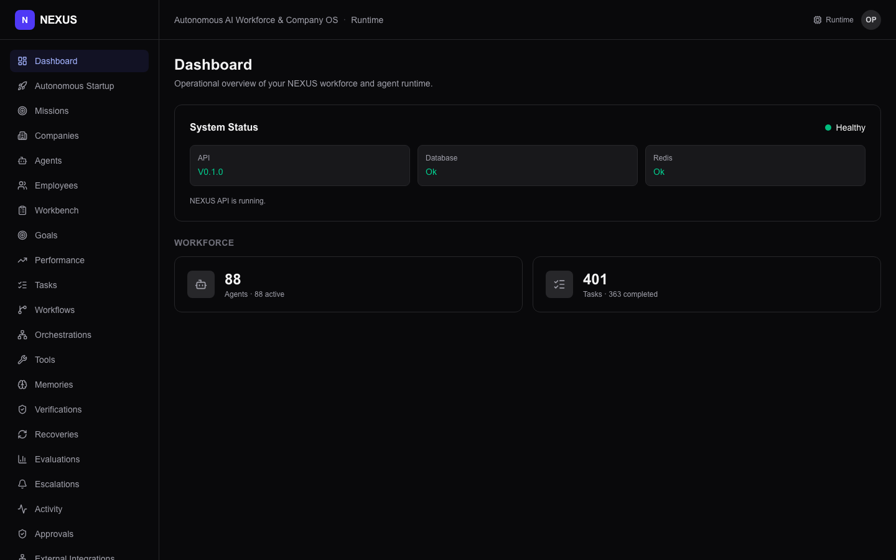
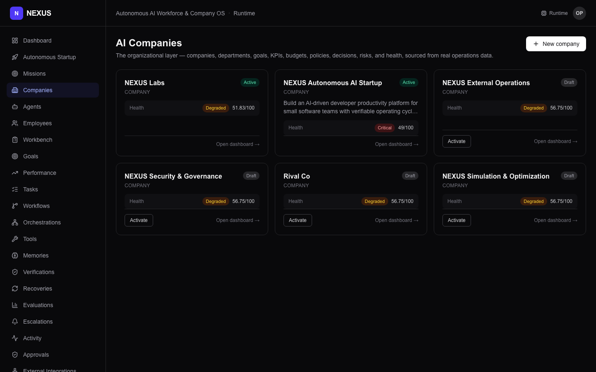
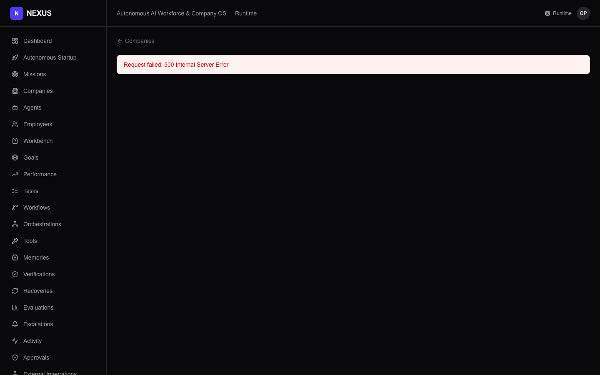
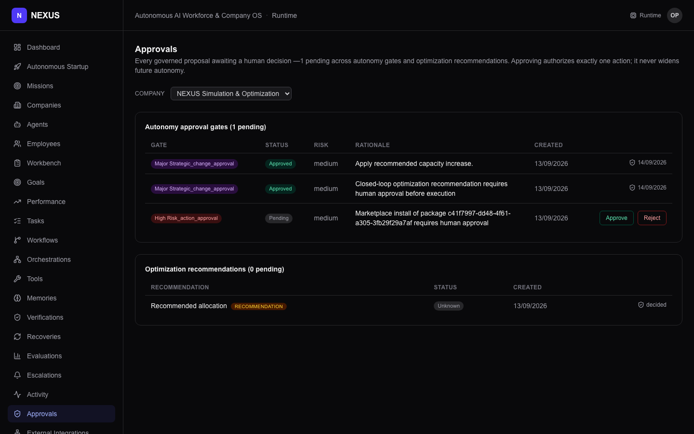
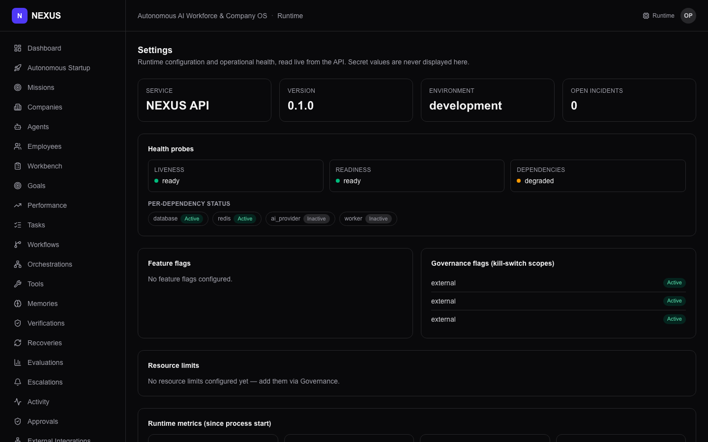
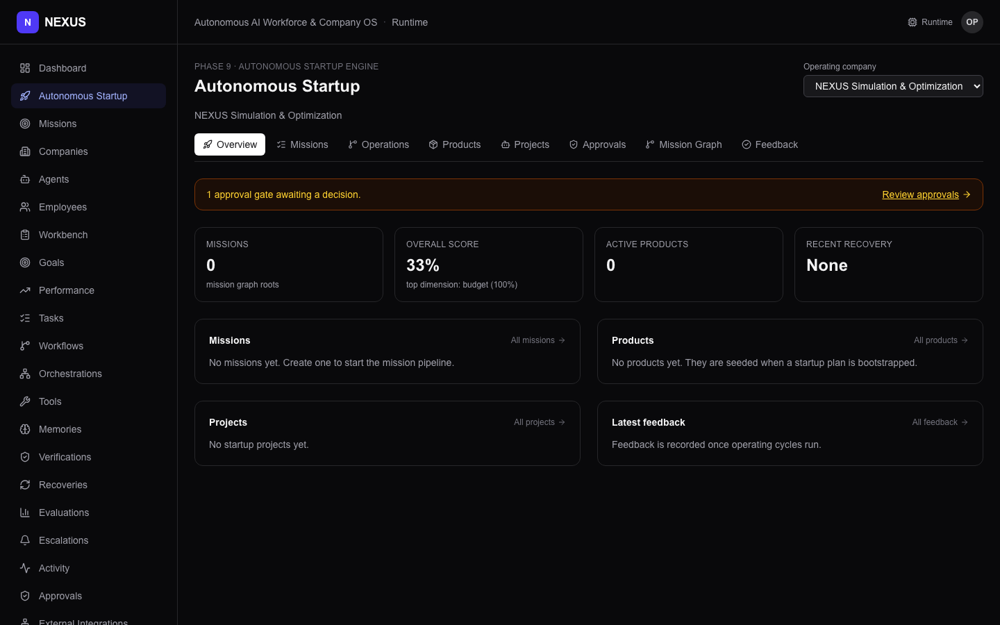
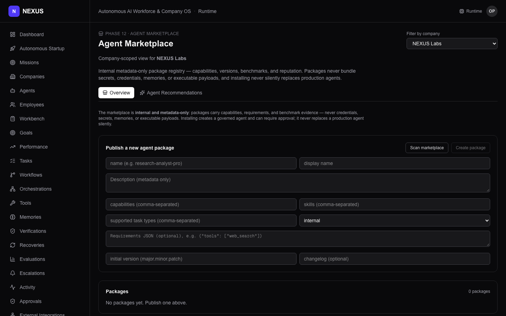
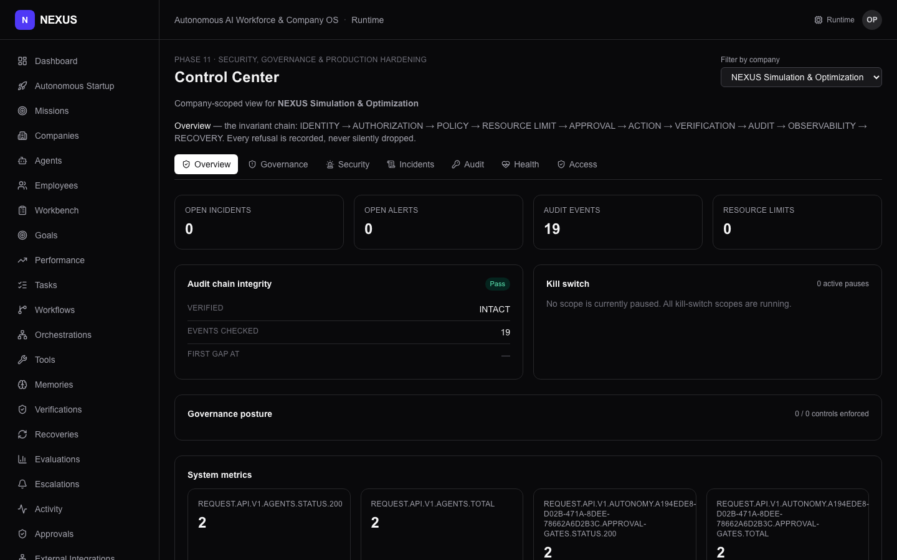

# NEXUS — UI Tour

A route-by-route guide to every section of the web console. All screenshots
were taken against the fully-seeded Docker stack (via `bash scripts/run_demos.sh`).

Open the UI at <http://localhost:3000> before reading this guide.

---

## Dashboard — `/`

The landing page shows a live operational overview: API/DB/Redis status tiles,
agent and task counts, and an activity feed pulled from real execution records.



**What to look for:**
- **System Status** panel at top: API version, Database (Ok), Redis (Ok)
- **Workforce tiles**: live counts of agents and tasks, with completion stats
- Sidebar: every phase is visible as its own nav item

---

## Companies — `/companies`

The company directory. Each row shows a live company with its status badge,
active agent/employee counts, and KPI summary. This is the top-level
organizational view.



**What to look for:**
- **NEXUS Labs** (or whichever company is seeded first) should appear at the
  top after the ordering fix — this is the flagship with the richest demo data
- Each card shows a status badge (active, draft, paused, archived) and live
  metric counts

---

## Company Detail — `/companies/{id}`

The executive dashboard for a single company: org chart, health score, KPIs,
budgets, decisions, risks, alerts, and reports — all computed from real
execution data in the database.



**What to look for:**
- **Health Score**: a composite across execution, quality, reliability, cost,
  goal-progress, and risk-posture dimensions
- **Org chart**: departments and employees nested under them
- Multiple tabs for goals, budgets, decisions, risks, alerts, events

---

## Approvals — `/approvals`

All pending approval gates in one place: governance actions, simulation
recommendations, marketplace installs, external integrations — anything that
requires a human decision before the system can proceed.



**What to look for:**
- Each row shows what is pending, who it belongs to, the type of gate, and
  when it was raised
- Approve or reject buttons — approving updates the audit log and unblocks the
  gated operation downstream

---

## Settings — `/settings`

System-level configuration: environment, feature flags, security parameters,
database info, and worker settings — read from the live backend.



**What to look for:**
- Configuration categories shown as cards with live status
- Note: secrets are never displayed; the page reads from `/settings` which
  masks all sensitive values

---

## Autonomous Startup — `/startup`

The Phase 9 mission engine: create a business mission, run analysis, build a
startup plan, approve + bootstrap a company, then run governed operating cycles.



**What to look for:**
- Mission status cards with phase indicators (analyzing, planned, active)
- Operating cycle history and approval gates for strategic decisions
- The startup planning flow: strategic plan → startup plan → bootstrap → run

---

## Agent Marketplace — `/marketplace`

Phase 12's internal agent package catalog. Each package is metadata-only
(capabilities, requirements, benchmark scores) — no executable payloads,
no credentials, no secrets.



**What to look for:**
- **Company-scoped filter** in top-right dropdown — defaults to NEXUS Labs
- **Publish form**: create a new package with capabilities, skills, requirements
  JSON, and version; the form is visible on a fresh seed (packages start at 0)
- After publishing: **Published packages** with status badges (Published, Draft,
  Deprecated) and security classification (Internal, Confidential)
- **Agent Recommendations** tab: evidence-based rankings from benchmark scores
  (appears after benchmark data exists)

---

## Control Center — `/control`

Phase 11's governance and security dashboard: security events, audit log,
incidents, governance policies, health status, and access controls.



**What to look for:**
- **Audit log**: append-only hash-chained events (click to verify chain
  integrity)
- **Security events**: categorized detections (13 categories) with status
- **Incidents**: active incidents with containment actions
- **Health**: system health across all subsystems

---

## Other Pages

The sidebar includes these additional views — all rendering real data from
the seeded stack:

| Route | What it shows |
|-------|---------------|
| `/agents` | Agent directory with provider, role, status, and execution history |
| `/tasks` | Task queue with assign/execute actions and per-task tool-call traces |
| `/activity` | Global execution feed — every agent execution in chronological order |
| `/workflows` | Workflow builder and execution trace viewer |
| `/orchestrations` | Multi-agent orchestration runs with task graphs and collaboration threads |
| `/tools` | Registered tool definitions (calculator, datetime, text_utils, json_utils) |
| `/memories` | Memory browser with hybrid search, filter by type/status/agent |
| `/employees` | AI Employee directory with skills, goals, workload, performance |
| `/employee-goals` | Company-wide goal dashboard across all employees |
| `/employee-performance` | Performance metrics and automated review history |
| `/employee-workbench` | Per-employee task inbox and context view |
| `/verifications` | Verification run history with PASS/FAIL/PARTIAL/UNCERTAIN outcomes |
| `/recoveries` | Recovery timeline for failed executions (per-attempt strategy trace) |
| `/evaluations` | Metric datasets, run results, regression detection |
| `/escalations` | Pending human-approval escalations (approve/reject) |
| `/simulations` | Phase 12 sandbox simulation runs |
| `/experiments` | Approval-gated experiment lifecycle |
| `/optimization` | Multi-objective optimization with explainability and approval gates |

---

## Screenshots

All screenshots are stored in [`docs/images/`](images/) and were captured
with headless Chrome against the seeded Docker stack at 1440×900 viewport.
To re-capture with fresh data:

```bash
bash scripts/run_demos.sh           # reset + seed everything
# then capture via headless Chrome against localhost:3000
```
